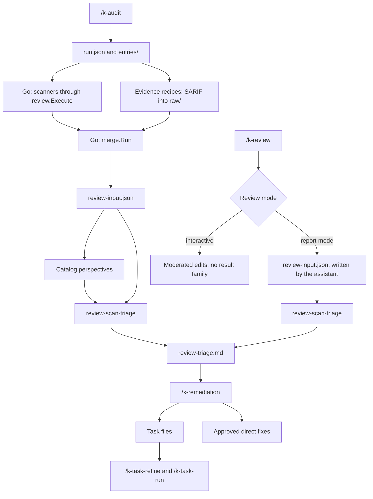

# Code Review Flow

This page describes how a review runs in k-playbook: the two paths that lead into it, the
artifacts they create, the result families, and the handoff to `/k-remediation`. Reviews of a
specific GitHub pull request are described in [`pr-review.md`](./pr-review.md).

Both paths end in the same artifact, `review-triage.md`, and in the same handoff — for
`/k-review` that holds in report mode; an interactive run moderates edits and creates no result
family. What differs is state, tooling, and scope. Either way, k-playbook separates three steps: **run** a review or
audit, **store** its results under `k-playbook-local/results/`, and **work through** them with
`/k-remediation`.

**Which page owns what.** So that the boundary does not slip again: this page describes both
paths, the family flow, and the family artifacts. [`review-runs.md`](./review-runs.md) describes
the inside of a run — `run.json`, `entries/`, states, merge. [`mcp.md`](./mcp.md) describes the
tool contract of the MCP server. Content that belongs on one of the other pages is linked from
here instead of repeated.

## The Two Paths

| | `/k-audit` | `/k-review <name>` |
|---|---|---|
| State | `run.json`, `entries/`, resumable | none |
| MCP | yes, five tools | **no** |
| Scanners | Go, through `review.Execute` | none |
| `review-input.json` | Go, through `merge.Run` | the assistant, core of the contract only |
| Consolidation across sources | yes | no |
| Location | `k-playbook-local/results/YYYY-MM-DD/` | `k-playbook-local/results/<family>/YYYY-MM-DD/` |

MCP belongs to `/k-audit`. Its `allowed-tools` list carries the five `k_playbook_review_*` tools,
and the whole run is driven through them. `/k-review` works **without** MCP: it carries no MCP
tool at all, starts no scanner, and holds no run state.

## Division of Labour



- Go owns the scanners. `k_playbook_review_scan` does not shell out to the CLI; it calls
  `review.Execute`. MCP inputs contain no shell commands, and the assistant never starts a
  scanner itself.
- Go owns consolidation: deduplication, stable group IDs, and coverage from `known-decisions.md`.
- The assistant owns the judgements: evidence recipes, perspectives, triage, priority, and
  category.
- The state lives on disk, not in the chat. That is what makes `/k-audit` resumable.
- The interface creates no run. It only offers `GET /api/reviews`.

Consolidation happens at **one** point: in the audit run. The merge deduplicates across tools,
records coverage from `known-decisions.md`, and the triage assigns priority and category. No
downstream step repeats the same work at a higher level.

## /k-audit

`/k-audit` is the chat entry point for the complete scan-and-assessment sweep. It holds no state
of its own: every invocation reads the actual state from the run directory through the MCP tools
and continues exactly there. The nine steps:

1. Determine paths and run — a new run, `latest`, or a given date.
2. Read the status through `k_playbook_review_status`.
3. Clarify the selection for a new run and create it through `k_playbook_review_create`.
4. Start the scanners through `k_playbook_review_scan`; Go executes the tool entries.
5. Run the evidence recipes, **before** the merge. They do not read `review-input.json`; they
   supply a part of it as `raw/<entry>.sarif`.
6. Start the merge through `k_playbook_review_merge`; Go writes `review-input.json` and
   `review-input.md`.
7. Run the catalog perspectives, only once `review-input.json` exists in the run directory.
8. Write the assessment with `review-scan-triage` into `review-triage.md`.
9. Close out and hand off: read the status again, report run, entry states, and artifacts, and
   name the next command.

Details of the run itself — `run.json`, `entries/`, entry states, repair, and the merge — are in
[`review-runs.md`](./review-runs.md). The tool contract is in [`mcp.md`](./mcp.md#tools).

## /k-review

`/k-review` runs review recipes against the current project. The command is the entry point for
structured reviews outside a specific GitHub PR.

Invocations:

```text
/k-review
/k-review tech
/k-review secret-scanning
```

Without an argument, the command shows the effective recipe set from `k-playbook/reviews/` and
`k-playbook-local/reviews/`.

The command:

- derives locations from the position of `K-PLAYBOOK.yaml`.
- writes the log and results to `k-playbook-local/results/`.
- separates the generic flow from concrete review criteria.
- lets project-owned recipes completely replace shipped recipes with the same filename.
- considers `k-playbook-local/known-decisions.md` so that deliberate decisions do not repeatedly
  appear as new findings. The file is beside `results/`, not inside it: it is maintained by hand
  and generated by no review.

Interactive reviews moderate one location at a time:

- Search for candidates.
- Show a compact finding list.
- Collect questions for unclear points.
- Show a proposal for each location and wait for approval.
- Apply only confirmed changes.

Report-mode reviews create result artifacts:

```text
k-playbook-local/results/<family>/<YYYY-MM-DD>/review-input.json
k-playbook-local/results/<family>/<YYYY-MM-DD>/review-triage.md
k-playbook-local/results/<family>/<YYYY-MM-DD>/raw/
```

In report mode the assistant writes `review-input.json` itself, following the **core** of the
evidence contract; the merge-only fields stay out, because `/k-review` runs no MCP tool and the
Go merge is never available here. A `/k-review` run therefore consolidates nothing: it does not
deduplicate against other sources, and its family directory sits outside every run directory.

`assessment.md` and `findings.md` are now only legacy artifacts in existing historical result
directories. New report reviews with `result-family` write `review-input.json` as the evidence
contract and `review-triage.md` as the handoff. The contract itself is in
`commands/_review-run/review-input-contract.md`; it applies equally to the audit and report paths
and identifies what only the merge provides.

Every report recipe requires a `result-family`; there is no alternative path. If it is missing
from the frontmatter, `/k-review` stops instead of placing a result in a substitute location.

Typical review families:

- `/k-review k-check-security`
- `/k-review secret-scanning`
- `/k-review dependency-cve`
- `/k-review dependabot-alerts`
- `/k-review iac-container`
- `/k-review sast`
- `/k-review tech`
- `/k-review python-comment-hardspots`

## /k-remediation

`/k-remediation` works through findings from review results in a structured way. It does not
aggregate on its own: it takes exactly one result file and bundles its findings before
implementation.

Invocations:

```text
/k-remediation
/k-remediation k-playbook-local/results/<date>/review-triage.md
/k-remediation k-playbook-local/results/<family>/<date>/review-triage.md
```

Supported inputs:

- Audit runs such as `k-playbook-local/results/<date>/review-triage.md`: the primary path.
- Result families such as `k-playbook-local/results/<family>/<date>/review-triage.md`.
- Legacy: existing `k-playbook-local/results/summary-YYYY-MM-DD.md` from the time when a
  downstream prioritization step still existed. They are read and processed, but nothing creates
  them any longer.
- Legacy: directories with `assessment.md` and `findings.md`, only when `review-triage.md` is
  absent.

The command accepts exactly **one** result file. It does not add a second source or deduplicate
against other runs; anyone needing consolidation brings their evidence into the audit run.

The command:

- loads open findings.
- considers `known-decisions.md`.
- bundles findings by risk, effort, coupling, quick-win potential, and shared verification.
- shows the remediation policy from `K-PLAYBOOK.yaml`.
- turns confirmed bundles into tasks or approved direct fixes.
- compares findings with existing tasks before creating tasks: source plus bundle/group ID must
  match. A match in `tasks/` prevents a second task; a match in `tasks/done/` is reported but does
  not close the finding.
- maintains statuses and task references traceably in `review-triage.md`; for legacy inputs,
  continues to do so in the summary or `findings.md`.

`raw/` and run metadata remain read-only. They are auditable evidence and must not be rewritten.

The project-wide policy sits in the `remediation:` block of `K-PLAYBOOK.yaml`; its fields, the
modes, and what applies when the block is absent are specified in
[`k-playbook-format.md`](./k-playbook-format.md#remediation).

The result path in a committed task is a **provenance statement, not a resolvable reference**:
`results/` is not versioned, but tasks are. Anyone reading the task from the repository does not
have the result file, and even on the machine that created it, it is overwritten by the next run.
Inline evidence therefore remains required: group IDs, location, and message belong in the task
itself, not only in a reference.

## Scanner Tools vs. k-check

Security scanners such as `gitleaks`, `trufflehog`, `pip-audit`, `trivy`, `syft`, `grype`,
`semgrep`, `gosec`, `ruff`, and `njsscan` are **not** modeled as checks under `checks/*.sh`.

Reason:

- They create their own structured raw data such as JSON, SARIF-like reports, or SBOMs.
- Non-zero exit codes often mean substantive findings, not technical errors.
- Results must be deduplicated, prioritized, and assessed.
- Raw artifacts must permanently reside under
  `k-playbook-local/results/<family>/YYYY-MM-DD/raw/`.
- Remediation needs stable finding IDs, status values, and source evidence.

These tools therefore run through report-mode reviews:

| Tool | Review | Result family |
|---|---|---|
| `gitleaks` | `/k-review secret-scanning` | `secret-scanning` |
| `trufflehog` | `/k-review secret-scanning` | `secret-scanning` |
| `pip-audit` | `/k-review dependency-cve` | `dependency-cve` |
| `trivy` | `/k-review dependency-cve` and `/k-review iac-container` | `dependency-cve` / `iac-container` |
| `syft` | `/k-review iac-container` | `iac-container` |
| `grype` | `/k-review dependency-cve` or `/k-review iac-container` | `dependency-cve` / `iac-container` |
| `semgrep` | `/k-review sast` | `sast` |
| `gosec` | `/k-review sast` | `sast` |
| `ruff` | `/k-review sast` | `sast` |
| `njsscan` | `/k-review sast` | `sast` |
| GitHub Dependabot Alerts | `/k-review dependabot-alerts` | `dependabot-alerts` |

`checks/*.sh` remains reserved for fast, generic k-check heuristics and preflight-like checks.
Small tool-availability checks may reside there, but not the actual scanner run with persistent
assessment.

## The Families in Detail

### k-check

| | |
|---|---|
| Recipe | `k-playbook/reviews/review-k-check-security.md` |
| Runner | `k-playbook/bin/k-check` |
| Results | `k-playbook-local/results/k-check/YYYY-MM-DD/` |

Typical auditable run:

```bash
k-playbook/bin/k-check \
  --mode baseline \
  --output k-playbook-local/results/k-check/YYYY-MM-DD/raw/k-check-baseline.txt \
  --metadata-output k-playbook-local/results/k-check/YYYY-MM-DD/run-metadata.json
```

`--output` receives stdout/stderr and additionally writes the complete raw stream.
`--metadata-output` writes the command, exit code, timestamp, roots, mode, check configuration,
and version or Git commit where available.

Existing target files are not overwritten. Use unique names for repeat runs on the same day, for
example `k-check-baseline-e2e.txt` and `run-metadata-e2e.json`.

### Secret Scanning

| | |
|---|---|
| Recipe | `k-playbook/reviews/review-secret-scanning.md` |
| Results | `k-playbook-local/results/secret-scanning/YYYY-MM-DD/` |
| Audit perspective | `k-playbook-local/results/YYYY-MM-DD/review-secret-scanning.md` |
| Audit scope | `gitleaks`, `trufflehog` |

Typical artifacts: `review-input.json`, `review-triage.md`, `raw/gitleaks-*.json`,
`raw/trufflehog.json`.

The tools are provided locally on the host by
`k-playbook/scripts/install-security-tools.sh`. Missing tools are not installed into the project.

### Dependency CVE

| | |
|---|---|
| Recipe | `k-playbook/reviews/review-dependency-cve.md` |
| Results | `k-playbook-local/results/dependency-cve/YYYY-MM-DD/` |
| Audit perspective | `k-playbook-local/results/YYYY-MM-DD/review-dependency-cve.md` |
| Audit scope | `pip-audit`, `trivy`, `grype`, `osv-scanner`, `govulncheck` |

Typical artifacts: `review-input.json`, `review-triage.md`, `raw/pip-audit.json`,
`raw/trivy-fs.json`, and, where needed, `raw/grype.json`.

This recipe is active in the audit run model. It assesses the groups from `review-input.json`
that carry at least one evidence item from an audit-scope tool.

### GitHub Dependabot Alerts

| | |
|---|---|
| Recipe | `k-playbook/reviews/review-dependabot-alerts.md` |
| Results | `k-playbook-local/results/dependabot-alerts/YYYY-MM-DD/` |
| Audit run model | disabled; rationale and examined alternatives are in the recipe |

Typical artifacts: `review-input.json`, `review-triage.md`, `raw/dependabot-alerts-open.jsonl` as
an auditable import, and `raw/dependabot-alerts-summary.tsv` for rapid triage.

This family uses GitHub as its source. It is particularly suitable when a project does not use
local dependency scanners or first wants to assess the alert set present in GitHub. Intentionally
disabled Dependabot PRs, for example `open-pull-requests-limit: 0`, are not a finding.

### IaC/Container

| | |
|---|---|
| Recipe | `k-playbook/reviews/review-iac-container.md` |
| Results | `k-playbook-local/results/iac-container/YYYY-MM-DD/` |
| Audit perspective | `k-playbook-local/results/YYYY-MM-DD/review-iac-container.md` |
| Audit scope | `trivy`, `syft`, `grype` |

Typical artifacts: `review-input.json`, `review-triage.md` for container, image, IaC, and
filesystem findings, `raw/trivy-*.json`, and, where needed, `raw/syft-*.json` and
`raw/grype-*.json`.

This recipe is active in the audit run model. It assesses the groups from `review-input.json`
that carry at least one evidence item from an audit-scope tool.

### SAST

| | |
|---|---|
| Recipe | `k-playbook/reviews/review-sast.md` |
| Results | `k-playbook-local/results/sast/YYYY-MM-DD/` |
| Audit perspective | `k-playbook-local/results/YYYY-MM-DD/review-sast.md` |
| Audit scope | `semgrep`, `gosec`, `ruff`, `njsscan` |

Typical artifacts: `review-input.json`, `review-triage.md`, `raw/semgrep.sarif`,
`raw/gosec.sarif`, `raw/ruff.sarif`, and `raw/njsscan.sarif`.

This recipe is active in the audit run model. It assesses the groups from `review-input.json`
that carry at least one evidence item from an audit-scope tool. It assesses patterns in the
project's own source code: findings about a version or a package belong to Dependency CVE,
secrets to Secret Scanning, and IaC or container configuration to IaC/Container.

### Tech Debt

| | |
|---|---|
| Recipe | `k-playbook/reviews/review-tech.md` |
| Results | `k-playbook-local/results/tech/YYYY-MM-DD/` |
| Audit entry | Evidence source `tech`, SARIF under `k-playbook-local/results/YYYY-MM-DD/raw/tech.sarif` |

Typical artifacts in report mode: `review-input.json` and `review-triage.md`. This recipe operates
in two modes with the same review criteria; only the result form differs. See also **Recipes as
evidence sources** below.

### Recipes as Evidence Sources

Two catalog recipes provide their own evidence from code in a run rather than filtering existing
evidence. They run before the merge, read only their frozen `scope.paths`, and write SARIF to
`raw/<entry>.sarif`:

| Recipe | Entry | What it reads |
|---|---|---|
| `review-tech.md` | `tech` | Source and infrastructure files; tech-debt candidates with `tech-*` rule IDs. |
| `review-python-comment-hardspots.md` | `python-comment-hardspots` | Python sources; locations without reconstructable rationale, with `hardspot-*` rule IDs. |

Both remain selectable through `/k-review`: `review-tech` in report mode with the `tech` result
family, and `review-python-comment-hardspots` interactively. The review criteria are the same in
both modes; only the result form differs.

### Family-Only Recipes in the Audit Run Model

Some catalog recipes remain selectable through `/k-review` but are disabled for `/k-audit` until
their inputs are available as evidence in `review-input.json` or a separate scope contract exists:

| Recipe | Reason |
|---|---|
| `review-k-check-security.md` | `k-check` results are not yet modeled as evidence in the merge. |
| `review-dependabot-alerts.md` | Input arrives externally through `gh api` and is not yet a tool entry in the run merge. |

Both recipes contain their detailed examination themselves: their **Position in the audit run
model** section states which part of the evidence contract blocks them and what a conversion would
require. Until then, their `review-triage.md` goes directly to `/k-remediation`, **without**
consolidation across families and **without** deduplication against other sources. The same
applies to every independent `/k-review` run of a family recipe: the family directory is outside
every run directory and is not combined with the audit run.

## Directories

Recipes and results are strictly separate:

```text
k-playbook/reviews/                    shipped recipes
k-playbook-local/reviews/              project-owned recipes, overlay
k-playbook-local/known-decisions.md    deliberately made decisions, maintained by hand
k-playbook-local/results/              everything reviews create
```

`reviews/` contains only `review-<name>.md`. This keeps it a pure overlay directory, where every
file follows the same rule: same filename, the local file completely wins.

`known-decisions.md` deliberately sits one level higher, next to `rules/` and `guidelines/`: it is
maintained by hand and created by no review, so it is input rather than output. Everything
generated is next to it:

```text
k-playbook-local/results/
├── log.md                        when each review ran
├── YYYY-MM-DD/                   an audit run
└── <family>/YYYY-MM-DD/
    ├── review-input.json
    ├── review-triage.md
    ├── run-metadata.json
    └── raw/
```

Example:

```text
k-playbook-local/results/k-check/2026-07-24/
├── review-input.json
├── review-triage.md
├── run-metadata.json
└── raw/
    └── k-check-baseline.txt
```

`k-playbook-local/checks/` remains reserved for executable checks. Results never belong there.

### `results/` Is Not Versioned

The **entire** contents of `results/` are local, not only raw scanner output: `raw/` and
`entries/`, generated documents `review-input.md`, `review-input.json`, `run.json`, and
`review-triage.md`, review documents per family, plus `log.md` and, where they still exist, old
`summary-YYYY-MM-DD.md` files.

The reason is the same for all of them: a review is repeatable from the code. Its result is a
state from one machine at one point in time, not project knowledge. `log.md` is also personal:
when someone scanned on their machine is not the project's concern. And raw output from a secret
scanner contains discovered secrets in clear text; it must never enter the repository.

Whatever result is genuinely project knowledge is moved out anyway: to
`k-playbook-local/known-decisions.md`, which is precisely why it sits one level higher, and to
tasks created by remediation. The cost is accepted deliberately: AI assessments can no longer be
read in the repository.

Because this scope is homogeneous, the usual managed ignore content (`*`, `!.gitignore`,
`!README.md`) remains sufficient. `results/` and `cache/` are therefore the directories that
k-playbook creates privately during setup; like `priv/` and `material/`, both remain switchable
through the **Local settings** section of the interface. Nothing changes automatically for
existing projects: the managed `.gitignore` is created only when the directory is first created.

## Artifacts Per Family

Every new report/scan family creates these files:

- `review-input.json`: the evidence contract. Its schema is specified in exactly one place:
  `commands/_review-run/review-input-contract.md`. That document also describes which fields only
  the merge fills and what applies when they are absent.
- `review-triage.md`: a consistent final artifact with header, bundle table, bundle details,
  unbundled findings, and coverage from known decisions.
- `raw/`: auditable original output, for example SARIF, JSON, or tool logs.
- `run-metadata.json` or equivalent: auditable run metadata.

Raw artifacts and run metadata are auditable. They must not be shortened, overwritten, or
corrected in content after writing. Corrections are made through new raw files plus an updated
assessment.

`review-triage.md` is curated. It may be updated traceably, for example with a
`## Remediation status` section, but the original raw evidence remains unchanged. `assessment.md`
and `findings.md` are legacy artifacts of older result families and are read only when no
`review-triage.md` exists.

For runs in the new run model (`k-playbook-local/results/YYYY-MM-DD/`), a second artifact pair is
added: `review-input.json` and `review-input.md` from `k-playbook merge`. They consolidate `raw/`
and `entries/` and serve as input for assessment by the assistant. Details are in
[`review-runs.md`](./review-runs.md#consolidating-with-k-playbook-merge).

Who writes `review-input.json` therefore depends on the path: in the audit run it is the Go merge,
with the merge-only fields filled; on the family path it is the assistant, following the core of
the evidence contract and without those fields. The file name is the same, the guarantees are not.

The curated final product of both assessment paths is `review-triage.md`: directly under
`k-playbook-local/results/YYYY-MM-DD/` for audits, and under
`k-playbook-local/results/<family>/YYYY-MM-DD/` for targeted report reviews. Only the scope
differs. Active audit catalog recipes contribute differently depending on `audit.mode`. A
**perspective** (`mode: perspective`) additionally writes one perspective file directly into the
run directory, for example `review-secret-scanning.md`; it reads the same merge evidence, filters
through its stored `scope.tools`, and serves only as context for `scan-triage`. An **evidence
source** (`mode: evidence`) writes no Markdown at all; it runs before the merge and stores
`raw/<entry>.sarif`, whose findings subsequently appear as groups with the `ai-<entry>-` prefix in
`review-input.json` and thus follow the same path as scanner findings. `/k-remediation` works
against `review-triage.md`; legacy `assessment.md`/`findings.md` remain fallback only for family
directories without `review-triage.md`.

## Review Log

`/k-review` maintains the log beside the results:

```text
k-playbook-local/results/log.md
```

For each family, it contains the latest run, when the next is due, mode and focus, and a log line
with scope, output, and handoff.

Example handoff:

```text
/k-remediation k-playbook-local/results/k-check/2026-07-24/review-triage.md
```

Alongside this, `k-playbook-local/known-decisions.md` records what was deliberately decided. The
merge step reads this single file and writes its effect visibly into `review-input.json` and
`review-input.md`; the assessment then takes this information solely from the JSON.

## Status Model

The status table below is a **read path for legacy holdings**: those values belong to
`findings.md`, which new runs no longer write. It is listed here because `/k-remediation` still
reads such directories when no `review-triage.md` exists beside them. The rules that follow it —
ID stability, the k-check ID schema, and coverage from `known-decisions.md` — apply to the current
model as well.

| Status | Meaning | Relevant to remediation |
|---|---|---|
| `open` | new or not yet checked | yes |
| `confirmed` | validated real finding | yes |
| `context-needed` | further context review required | yes |
| `likely-false-positive` | plausible false positive | only after explicit selection |
| `accepted` | deliberate decision or accepted residual risk | no |
| `fixed` | fixed and verified | no |

Finding IDs must remain stable. IDs assigned once must not be renamed during re-runs, status
changes, or remediation.

Schema for k-check:

```text
kcheck-<area>-NNN
```

Examples: `kcheck-logging-003`, `kcheck-secrets-001`, `kcheck-user-scope-014`.

Scanner families may retain their tool's native rule prefixes so a finding remains traceable to
its raw report.

Deliberate project-wide decisions are recorded in `k-playbook-local/known-decisions.md` and
written by `k-playbook merge` as coverage on findings and groups. The format, location, and flow
rule are described in [`review-runs.md`](./review-runs.md#effect-of-known-decisionsmd). A decision
neither replaces a status value nor filters anything from raw data; it only makes visible that a
finding is covered by a documented decision.

## Handoff

After a report-mode review, `/k-review` names the next handoff, typically:

```text
/k-remediation k-playbook-local/results/<family>/<YYYY-MM-DD>/review-triage.md
```

`/k-audit` closes the same way, with the run directory instead of the family directory:

```text
/k-remediation k-playbook-local/results/<YYYY-MM-DD>/review-triage.md
```

If `/k-remediation` creates tasks, the next step is not direct implementation in chat but the
normal task flow:

```text
/k-task-refine
/k-task-run
```

Created tasks should contain branch/PR notes when policy requires them. `/k-task-run` evaluates
the `## Execution context` section and runs branch and dirty-worktree preflights before
delegation.

## Scope

- `/k-pr-review` is responsible for specific GitHub PRs.
- `/k-audit` is the only place where findings from multiple sources are consolidated and
  deduplicated. It is also the only review path that uses the MCP server.
- `/k-review` assesses or creates findings but does not directly implement larger remediation,
  and consolidates nothing.
- `/k-remediation` starts no scanners, accepts exactly one result file, and does not re-prioritize
  project-wide.
- Larger implementation proceeds through tasks, `/k-task-refine`, and `/k-task-run`.
- Direct fixes are allowed only with suitable policy and explicit approval.

## Security Tools

Project virtual environments are normal for project dependencies. Read-only status may measure an
active project virtual environment and labels that measurement context. Tool installation and
Docker fallbacks remain separate and local to the host/user; no project virtual environment may be
active before installation. Python CLI tools are recommended through `pipx` or, with
`--method venv`, in dedicated k-playbook tool virtual environments.

```bash
k-playbook/scripts/install-security-tools.sh                    # status
k-playbook/scripts/install-security-tools.sh --install missing  # asks before installation
k-playbook/scripts/install-security-tools.sh --install missing --method venv  # dedicated tool virtual environments
```

The required tools are canonically listed in
[`../scripts/security-tools.tsv`](../scripts/security-tools.tsv). The script, interface, and review
recipes read the same matrix.
