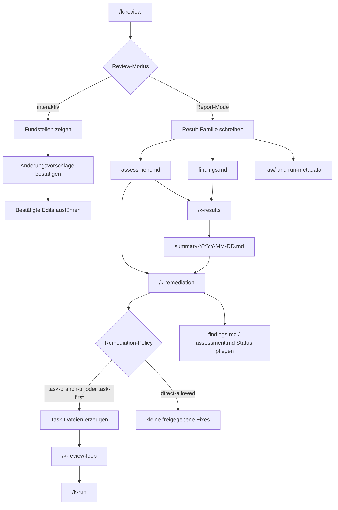

# Code-Review-Flow

Diese Seite fasst den k-playbook-Flow für Review-Rezepte, Result-Summaries und Remediation zusammen. Sie beschreibt Reviews außerhalb konkreter GitHub-PRs; PR-spezifische Reviews stehen in [`pr-review.md`](./pr-review.md).

## Überblick



Der Standardablauf für Report-Reviews ist:

```text
/k-review <name>
/k-results
/k-remediation <summary-or-assessment>
/k-review-loop
/k-run
```

## /k-review

`/k-review` führt Review-Rezepte gegen das aktuelle Projekt aus. Der Command ist der
Einstieg für strukturierte Reviews außerhalb eines konkreten GitHub-PRs.

Aufrufe:

```text
/k-review
/k-review tech
/k-review secret-scanning
```

Ohne Argument zeigt der Command die effektive Rezeptmenge aus `k-playbook/reviews/` und
`k-playbook-local/reviews/`.

Der Command:

- leitet die Orte aus der Lage der `K-PLAYBOOK.yaml` ab.
- schreibt Log und Ergebnisse nach `k-playbook-local/results/`.
- trennt generischen Ablauf von konkreten Review-Kriterien.
- lässt projekteigene Rezepte mitgelieferte gleichen Dateinamens vollständig ersetzen.
- berücksichtigt `known-decisions.md`, damit bewusste Entscheidungen nicht wiederholt als neue Findings auftauchen.

Interaktive Reviews moderieren Stelle für Stelle:

- Kandidaten suchen.
- kompakte Fundliste zeigen.
- bei unklaren Punkten Rückfragen gesammelt stellen.
- pro Stelle Vorschlag zeigen und auf Freigabe warten.
- nur bestätigte Änderungen ausführen.

Report-Mode-Reviews erzeugen Ergebnisartefakte:

```text
k-playbook-local/results/<familie>/<YYYY-MM-DD>/assessment.md
k-playbook-local/results/<familie>/<YYYY-MM-DD>/findings.md
k-playbook-local/results/<familie>/<YYYY-MM-DD>/raw/
```

Report-Mode-Reviews ohne eigene Ergebnisfamilie, z. B. `tech`, schreiben direkt eine Summary:

```text
k-playbook-local/results/summary-YYYY-MM-DD.md
```

Typische Review-Familien:

- `/k-review k-check-security`
- `/k-review secret-scanning`
- `/k-review dependency-cve`
- `/k-review dependabot-alerts`
- `/k-review iac-container`
- `/k-review tech`
- `/k-review python-comment-hardspots`

## /k-results

`/k-results` erzeugt aus vorhandenen Review-Result-Familien eine projektweite, priorisierte Summary. Der Command ist der Zwischenschritt zwischen Report-Reviews und Remediation.

Aufrufe:

```text
/k-results
/k-results latest
/k-results 2026-08-03
```

Der Command:

- liest vorhandene `assessment.md`- und `findings.md`-Dateien unter `k-playbook-local/results/`.
- startet keine Scanner.
- verändert keine Raw-Artefakte.
- dedupliziert Findings über Familien hinweg.
- berücksichtigt `known-decisions.md` und vorhandene Tasks, soweit vorhanden.
- schreibt eine Summary unter `k-playbook-local/results/summary-YYYY-MM-DD.md`.

Die Summary enthält:

- verwendete Quellen.
- priorisierte Übersicht.
- Dedupe-Entscheidungen.
- konkrete Empfehlungen.
- Handoff für Remediation.

Einzelne Result-Dateien können direkt an `/k-remediation` übergeben werden. `/k-results` ist für die projektweite Priorisierung mehrerer Familien zuständig.

## /k-remediation

`/k-remediation` arbeitet Findings aus Review-Ergebnissen strukturiert ab. Der Command plant zuerst sinnvolle Bündel und entscheidet danach anhand der Projekt-Policy, ob Tasks erzeugt oder kleine direkte Fixes erlaubt sind.

Aufrufe:

```text
/k-remediation
/k-remediation k-playbook-local/results/summary-YYYY-MM-DD.md
/k-remediation k-playbook-local/results/<familie>/<datum>/assessment.md
```

Unterstützte Inputs:

- Summaries von `/k-results` oder von Report-Reviews ohne eigene Ergebnisfamilie.
- Ergebnisfamilien wie `k-playbook-local/results/<familie>/<datum>/assessment.md` mit zugehörigem `findings.md`.

Der Command:

- lädt offene Findings.
- berücksichtigt `known-decisions.md`.
- bündelt Findings nach Risiko, Aufwand, Kopplung und Verifikation.
- zeigt die Remediation-Policy aus `K-PLAYBOOK.yaml`.
- überführt bestätigte Bündel in Tasks oder freigegebene direkte Fixes.
- pflegt Status und Task-Verweise nachvollziehbar in `findings.md` oder Summary.

`raw/` und Run-Metadaten bleiben read-only. Sie sind auditierbare Belege und dürfen nicht umgeschrieben werden.

## Remediation-Policy

Die Policy steht in `K-PLAYBOOK.yaml` im Block `remediation:`. Wichtige Felder sind:

- `mode`: `task-branch-pr`, `task-first` oder `direct-allowed`.
- `target`: Remediation-Ziel relativ zur `K-PLAYBOOK.yaml`; Default ist `project.repo_root`.
- `grouping`: ob Findings vor der Umsetzung gebündelt werden.
- `quick_wins`: ob einfache wirkungsstarke Bündel hervorgehoben werden.
- `branch_prefix`: empfohlener Prefix für Remediation-Branches.
- `pr_required` und `direct_fixes`: aus `mode` abgeleitet und mitgeschrieben, damit
  Commands sie lesen können, ohne den Modus deuten zu müssen.

Default ist `task-first`: nichts wird ohne Zutun am Code geändert, direkte Fixes bleiben
nach Freigabe trotzdem möglich.

Im Modus `task-branch-pr` erzeugt `/k-remediation` keine direkten Code-Fixes. Bestätigte Bündel werden als Task-Dateien mit Ausführungskontext geschrieben.

## Artefakte Und Status

Jede Report-/Scan-Familie soll diese Dateien erzeugen:

- `assessment.md`: kuratierte Gesamtbewertung, Kurzfazit, Priorisierung, Handoff.
- `findings.md`: mutable, statusfähige Arbeitsliste aller Findings oder bewusst gruppierter Baseline-Findings.
- `raw/`: auditierbare Originalausgaben, z. B. SARIF, JSON oder Tool-Logs.
- `run-metadata.json` oder äquivalent: auditierbare Laufmetadaten.

Standard-Statuswerte in `findings.md`:

| Status | Bedeutung | Remediation-Relevanz |
|---|---|---|
| `open` | neu oder noch nicht geprüft | ja |
| `confirmed` | validierter echter Befund | ja |
| `context-needed` | weitere Kontextprüfung nötig | ja |
| `likely-false-positive` | plausibler Fehlalarm | nur nach expliziter Auswahl |
| `accepted` | bewusste Entscheidung oder akzeptiertes Restrisiko | nein |
| `fixed` | behoben und verifiziert | nein |

Finding-IDs müssen stabil bleiben. Einmal vergebene IDs dürfen bei Re-Runs, Statusänderungen oder Remediation nicht umbenannt werden.

## Handoff

Nach einem Report-Mode-Review nennt `/k-review` den nächsten Handoff, typischerweise:

```text
/k-results
/k-remediation k-playbook-local/results/summary-YYYY-MM-DD.md
/k-remediation k-playbook-local/results/<familie>/<YYYY-MM-DD>/assessment.md
```

Wenn `/k-remediation` Tasks erzeugt, ist der nächste Schritt nicht direkte Umsetzung im Chat, sondern der normale Task-Flow:

```text
/k-review-loop
/k-run
```

Die erzeugten Tasks sollen Branch-/PR-Hinweise enthalten, wenn die Policy das verlangt. `/k-run` wertet den Abschnitt `## Ausführungskontext` aus und führt vor der Delegation Branch- und Dirty-Worktree-Preflights aus.

## Abgrenzung

- `/k-pr-review` ist für konkrete GitHub-PRs zuständig.
- `/k-review` bewertet oder erzeugt Findings, setzt größere Remediation aber nicht direkt um.
- `/k-results` ist read-mostly, erzeugt keine Tasks und führt keine Remediation aus.
- `/k-remediation` startet keine Scanner und priorisiert nicht projektweit neu.
- Größere Umsetzung läuft über Tasks, `/k-review-loop` und `/k-run`.
- Direkte Fixes sind nur bei passender Policy und expliziter Freigabe erlaubt.
