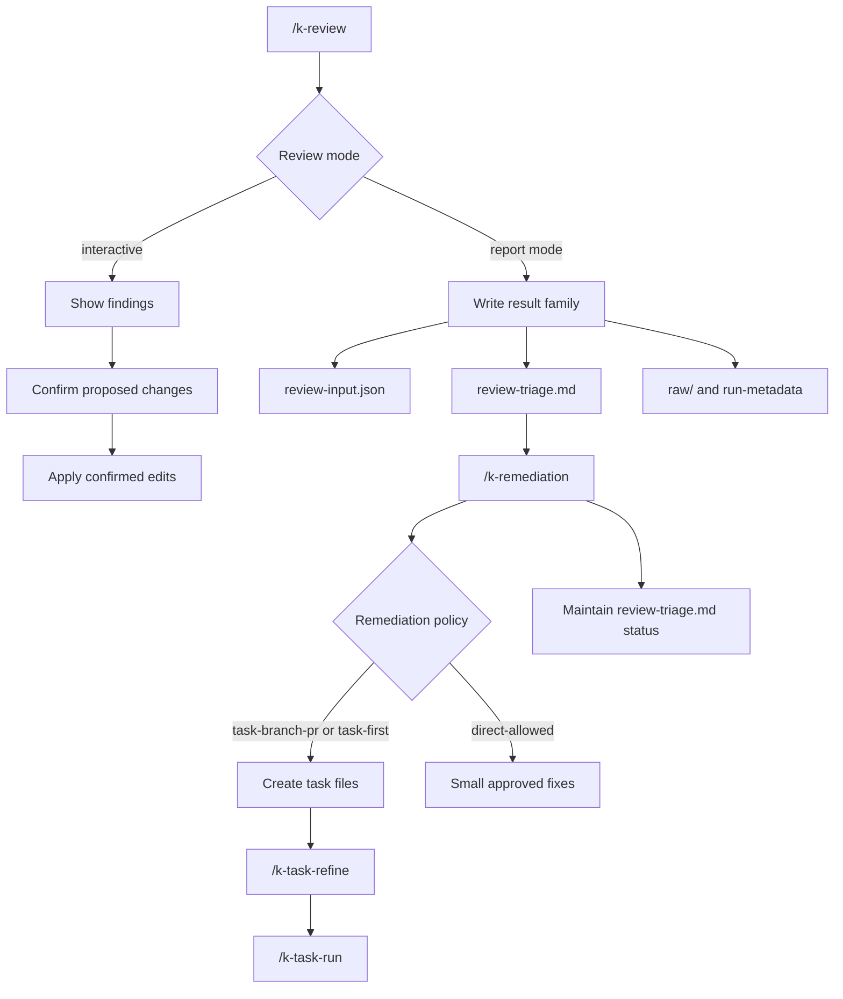

# Code Review Flow

This page summarizes the k-playbook flow for review recipes, result families, and remediation. It describes reviews outside specific GitHub PRs; PR-specific reviews are described in [`pr-review.md`](./pr-review.md).

## Overview



The standard flow for report reviews is:

```text
/k-review <name>
/k-remediation <review-triage>
/k-task-refine
/k-task-run
```

There is no additional step between review and remediation. `review-triage.md` is the final artifact of both assessment paths and the primary input of `/k-remediation`. Findings are consolidated at exactly one point: in the audit run, through the merge.

## /k-review

`/k-review` runs review recipes against the current project. The command is the entry point for structured reviews outside a specific GitHub PR.

Invocations:

```text
/k-review
/k-review tech
/k-review secret-scanning
```

Without an argument, the command shows the effective recipe set from `k-playbook/reviews/` and `k-playbook-local/reviews/`.

The command:

- derives locations from the position of `K-PLAYBOOK.yaml`.
- writes the log and results to `k-playbook-local/results/`.
- separates the generic flow from concrete review criteria.
- lets project-owned recipes completely replace shipped recipes with the same filename.
- considers `k-playbook-local/known-decisions.md` so that deliberate decisions do not repeatedly appear as new findings. The file is beside `results/`, not inside it: it is maintained by hand and generated by no review.

Interactive reviews moderate one location at a time:

- Search for candidates.
- Show a compact finding list.
- Collect questions for unclear points.
- Show a proposal for each location and wait for approval.
- Apply only confirmed changes.

Report-mode reviews create result artifacts:

```text
k-playbook-local/results/<family>/<YYYY-MM-DD>/review-input.json
k-playbook-local/results/<family>/<YYYY-MM-DD>/review-triage.md
k-playbook-local/results/<family>/<YYYY-MM-DD>/raw/
```

`assessment.md` and `findings.md` are now only legacy artifacts in existing historical result directories. New report reviews with `result-family` write `review-input.json` as the evidence contract and `review-triage.md` as the handoff. The contract itself is in `commands/_review-run/review-input-contract.md`; it applies equally to the audit and report paths and identifies what only the merge provides.

Every report recipe requires a `result-family`; there is no alternative path. If it is missing from the frontmatter, `/k-review` stops instead of placing a result in a substitute location.

Typical review families:

- `/k-review k-check-security`
- `/k-review secret-scanning`
- `/k-review dependency-cve`
- `/k-review dependabot-alerts`
- `/k-review iac-container`
- `/k-review tech`
- `/k-review python-comment-hardspots`

## /k-remediation

`/k-remediation` works through findings from review results in a structured way. The command first plans sensible bundles and then uses the project policy to decide whether to create tasks or allow small direct fixes.

Invocations:

```text
/k-remediation
/k-remediation k-playbook-local/results/<date>/review-triage.md
/k-remediation k-playbook-local/results/<family>/<date>/review-triage.md
```

Supported inputs:

- Audit runs such as `k-playbook-local/results/<date>/review-triage.md`: the primary path.
- Result families such as `k-playbook-local/results/<family>/<date>/review-triage.md`.
- Legacy: existing `k-playbook-local/results/summary-YYYY-MM-DD.md` from the time when a downstream prioritization step still existed. They are read and processed, but nothing creates them any longer.
- Legacy: directories with `assessment.md` and `findings.md`, only when `review-triage.md` is absent.

The command accepts exactly **one** result file. It does not add a second source or deduplicate against other runs; anyone needing consolidation brings their evidence into the audit run.

The command:

- loads open findings.
- considers `known-decisions.md`.
- bundles findings by risk, effort, coupling, and verification.
- shows the remediation policy from `K-PLAYBOOK.yaml`.
- turns confirmed bundles into tasks or approved direct fixes.
- compares findings with existing tasks before creating tasks: source plus bundle/group ID must match. A match in `tasks/` prevents a second task; a match in `tasks/done/` is reported but does not close the finding.
- maintains statuses and task references traceably in `review-triage.md`; for legacy inputs, continues to do so in the summary or `findings.md`.

`raw/` and run metadata remain read-only. They are auditable evidence and must not be rewritten.

## Remediation Policy

The policy is in the `remediation:` block of `K-PLAYBOOK.yaml`. Important fields are:

- `mode`: `task-branch-pr`, `task-first`, or `direct-allowed`.
- `target`: remediation target relative to `K-PLAYBOOK.yaml`; the default is `project.repo_root`.
- `grouping`: whether findings are bundled before implementation.
- `quick_wins`: whether simple, high-impact bundles are highlighted.
- `branch_prefix`: recommended prefix for remediation branches.
- `pr_required` and `direct_fixes`: derived from `mode` and recorded so commands can read them without interpreting the mode.

The default is `task-first`: no code is changed without action by the user, though direct fixes remain possible after approval.

In `task-branch-pr` mode, `/k-remediation` creates no direct code fixes. Confirmed bundles are written as task files with execution context.

## Artifacts And Status

Every new report/scan family should create these files:

- `review-input.json`: the evidence contract; its schema is in `commands/_review-run/review-input-contract.md`.
- `review-triage.md`: curated overall assessment, bundles, unbundled list, coverage from known decisions, and handoff.
- `raw/`: auditable original output, for example SARIF, JSON, or tool logs.
- `run-metadata.json` or equivalent: auditable run metadata.

`assessment.md` and `findings.md` remain readable only as a legacy fallback for historical results. New downstream handoffs point to `review-triage.md`.

Standard status values for legacy `findings.md`:

| Status | Meaning | Relevant to remediation |
|---|---|---|
| `open` | new or not yet checked | yes |
| `confirmed` | validated real finding | yes |
| `context-needed` | further context review required | yes |
| `likely-false-positive` | plausible false positive | only after explicit selection |
| `accepted` | deliberate decision or accepted residual risk | no |
| `fixed` | fixed and verified | no |

Finding IDs must remain stable. IDs assigned once must not be renamed during re-runs, status changes, or remediation.

## Handoff

After a report-mode review, `/k-review` names the next handoff, typically:

```text
/k-remediation k-playbook-local/results/<family>/<YYYY-MM-DD>/review-triage.md
```

If `/k-remediation` creates tasks, the next step is not direct implementation in chat but the normal task flow:

```text
/k-task-refine
/k-task-run
```

Created tasks should contain branch/PR notes when policy requires them. `/k-task-run` evaluates the `## Execution context` section and runs branch and dirty-worktree preflights before delegation.

## Scope

- `/k-pr-review` is responsible for specific GitHub PRs.
- `/k-review` assesses or creates findings but does not directly implement larger remediation.
- `/k-audit` is the only place where findings from multiple sources are consolidated and deduplicated.
- `/k-remediation` starts no scanners, accepts exactly one result file, and does not re-prioritize project-wide.
- Larger implementation proceeds through tasks, `/k-task-refine`, and `/k-task-run`.
- Direct fixes are allowed only with suitable policy and explicit approval.
