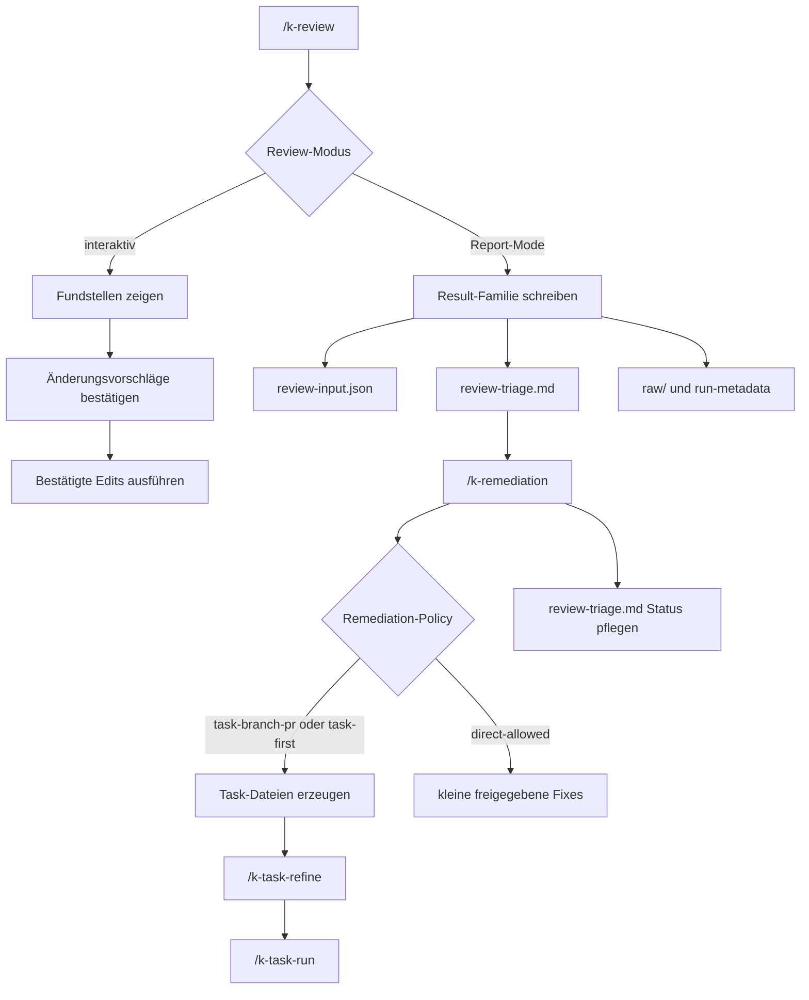

# Code-Review-Flow

Diese Seite fasst den k-playbook-Flow für Review-Rezepte, Ergebnisfamilien und Remediation zusammen. Sie beschreibt Reviews außerhalb konkreter GitHub-PRs; PR-spezifische Reviews stehen in [`pr-review.md`](./pr-review.md).

## Überblick



Der Standardablauf für Report-Reviews ist:

```text
/k-review <name>
/k-remediation <review-triage>
/k-task-refine
/k-task-run
```

Zwischen Review und Remediation steht kein weiterer Schritt. `review-triage.md` ist das
Endartefakt beider Bewertungswege und zugleich der Primärinput von `/k-remediation`.
Zusammengeführt werden Befunde an genau einer Stelle: im Audit-Lauf, über den Merge.

## /k-review

`/k-review` führt Review-Rezepte gegen das aktuelle Projekt aus. Der Command ist der
Einstieg für strukturierte Reviews außerhalb eines konkreten GitHub-PRs.

Aufrufe:

```text
/k-review
/k-review tech
/k-review secret-scanning
```

Ohne Argument zeigt der Command die effektive Rezeptmenge aus `k-playbook/reviews/` und
`k-playbook-local/reviews/`.

Der Command:

- leitet die Orte aus der Lage der `K-PLAYBOOK.yaml` ab.
- schreibt Log und Ergebnisse nach `k-playbook-local/results/`.
- trennt generischen Ablauf von konkreten Review-Kriterien.
- lässt projekteigene Rezepte mitgelieferte gleichen Dateinamens vollständig ersetzen.
- berücksichtigt `k-playbook-local/known-decisions.md`, damit bewusste Entscheidungen nicht wiederholt als neue Findings auftauchen. Die Datei liegt neben `results/`, nicht darin: sie wird von Hand gepflegt und von keinem Review erzeugt.

Interaktive Reviews moderieren Stelle für Stelle:

- Kandidaten suchen.
- kompakte Fundliste zeigen.
- bei unklaren Punkten Rückfragen gesammelt stellen.
- pro Stelle Vorschlag zeigen und auf Freigabe warten.
- nur bestätigte Änderungen ausführen.

Report-Mode-Reviews erzeugen Ergebnisartefakte:

```text
k-playbook-local/results/<familie>/<YYYY-MM-DD>/review-input.json
k-playbook-local/results/<familie>/<YYYY-MM-DD>/review-triage.md
k-playbook-local/results/<familie>/<YYYY-MM-DD>/raw/
```

`assessment.md` und `findings.md` sind nur noch Legacy-Artefakte bestehender
historischer Ergebnisordner. Neue Report-Reviews mit `result-family` schreiben
`review-input.json` als Belegvertrag und `review-triage.md` als Handoff. Der Vertrag
selbst steht in `commands/_review-run/review-input-contract.md`; er gilt für den
Audit-Weg und den Report-Weg gleichermaßen und benennt, was nur der Merge füllt.

Jedes Report-Rezept braucht eine `result-family`; einen Weg daneben gibt es nicht. Fehlt
sie im Frontmatter, bricht `/k-review` ab, statt ein Ergebnis an einem Ersatzort abzulegen.

Typische Review-Familien:

- `/k-review k-check-security`
- `/k-review secret-scanning`
- `/k-review dependency-cve`
- `/k-review dependabot-alerts`
- `/k-review iac-container`
- `/k-review tech`
- `/k-review python-comment-hardspots`

## /k-remediation

`/k-remediation` arbeitet Findings aus Review-Ergebnissen strukturiert ab. Der Command plant zuerst sinnvolle Bündel und entscheidet danach anhand der Projekt-Policy, ob Tasks erzeugt oder kleine direkte Fixes erlaubt sind.

Aufrufe:

```text
/k-remediation
/k-remediation k-playbook-local/results/<datum>/review-triage.md
/k-remediation k-playbook-local/results/<familie>/<datum>/review-triage.md
```

Unterstützte Inputs:

- Audit-Läufe wie `k-playbook-local/results/<datum>/review-triage.md` — der Hauptweg.
- Ergebnisfamilien wie `k-playbook-local/results/<familie>/<datum>/review-triage.md`.
- Legacy: vorhandene `k-playbook-local/results/summary-YYYY-MM-DD.md` aus der Zeit, als es noch einen nachgelagerten Priorisierungsschritt gab. Sie werden gelesen und abgearbeitet, aber von nichts mehr erzeugt.
- Legacy: Ordner mit `assessment.md` und `findings.md`, nur wenn kein `review-triage.md` vorhanden ist.

Der Command nimmt genau **eine** Ergebnisdatei. Er führt keine zweite Quelle hinzu und
dedupliziert nicht gegen andere Läufe; wer eine Zusammenführung braucht, bringt seine
Belege in den Audit-Lauf.

Der Command:

- lädt offene Findings.
- berücksichtigt `known-decisions.md`.
- bündelt Findings nach Risiko, Aufwand, Kopplung und Verifikation.
- zeigt die Remediation-Policy aus `K-PLAYBOOK.yaml`.
- überführt bestätigte Bündel in Tasks oder freigegebene direkte Fixes.
- gleicht Befunde vor der Task-Erzeugung gegen bestehende Tasks ab: Quelle plus Bündel-/Gruppen-ID müssen übereinstimmen. Ein Treffer in `tasks/` verhindert einen zweiten Task; ein Treffer in `tasks/done/` wird gemeldet, schließt den Befund aber nicht.
- pflegt Status und Task-Verweise nachvollziehbar in `review-triage.md`; bei Legacy-Inputs weiter in der Summary bzw. in `findings.md`.

`raw/` und Run-Metadaten bleiben read-only. Sie sind auditierbare Belege und dürfen nicht umgeschrieben werden.

## Remediation-Policy

Die Policy steht in `K-PLAYBOOK.yaml` im Block `remediation:`. Wichtige Felder sind:

- `mode`: `task-branch-pr`, `task-first` oder `direct-allowed`.
- `target`: Remediation-Ziel relativ zur `K-PLAYBOOK.yaml`; Default ist `project.repo_root`.
- `grouping`: ob Findings vor der Umsetzung gebündelt werden.
- `quick_wins`: ob einfache wirkungsstarke Bündel hervorgehoben werden.
- `branch_prefix`: empfohlener Prefix für Remediation-Branches.
- `pr_required` und `direct_fixes`: aus `mode` abgeleitet und mitgeschrieben, damit
  Commands sie lesen können, ohne den Modus deuten zu müssen.

Default ist `task-first`: nichts wird ohne Zutun am Code geändert, direkte Fixes bleiben
nach Freigabe trotzdem möglich.

Im Modus `task-branch-pr` erzeugt `/k-remediation` keine direkten Code-Fixes. Bestätigte Bündel werden als Task-Dateien mit Ausführungskontext geschrieben.

## Artefakte Und Status

Jede neue Report-/Scan-Familie soll diese Dateien erzeugen:

- `review-input.json`: der Belegvertrag; sein Schema steht in `commands/_review-run/review-input-contract.md`.
- `review-triage.md`: kuratierte Gesamtbewertung, Bündel, Nicht-gebündelt-Liste, Deckung aus Known-Decisions und Handoff.
- `raw/`: auditierbare Originalausgaben, z. B. SARIF, JSON oder Tool-Logs.
- `run-metadata.json` oder äquivalent: auditierbare Laufmetadaten.

`assessment.md` und `findings.md` bleiben nur als Legacy-Fallback für historische
Ergebnisse lesbar. Neue Downstream-Handoffs zeigen auf `review-triage.md`.

Standard-Statuswerte für Legacy-`findings.md`:

| Status | Bedeutung | Remediation-Relevanz |
|---|---|---|
| `open` | neu oder noch nicht geprüft | ja |
| `confirmed` | validierter echter Befund | ja |
| `context-needed` | weitere Kontextprüfung nötig | ja |
| `likely-false-positive` | plausibler Fehlalarm | nur nach expliziter Auswahl |
| `accepted` | bewusste Entscheidung oder akzeptiertes Restrisiko | nein |
| `fixed` | behoben und verifiziert | nein |

Finding-IDs müssen stabil bleiben. Einmal vergebene IDs dürfen bei Re-Runs, Statusänderungen oder Remediation nicht umbenannt werden.

## Handoff

Nach einem Report-Mode-Review nennt `/k-review` den nächsten Handoff, typischerweise:

```text
/k-remediation k-playbook-local/results/<familie>/<YYYY-MM-DD>/review-triage.md
```

Wenn `/k-remediation` Tasks erzeugt, ist der nächste Schritt nicht direkte Umsetzung im Chat, sondern der normale Task-Flow:

```text
/k-task-refine
/k-task-run
```

Die erzeugten Tasks sollen Branch-/PR-Hinweise enthalten, wenn die Policy das verlangt. `/k-task-run` wertet den Abschnitt `## Ausführungskontext` aus und führt vor der Delegation Branch- und Dirty-Worktree-Preflights aus.

## Abgrenzung

- `/k-pr-review` ist für konkrete GitHub-PRs zuständig.
- `/k-review` bewertet oder erzeugt Findings, setzt größere Remediation aber nicht direkt um.
- `/k-audit` ist der einzige Ort, an dem Befunde mehrerer Quellen zusammengeführt und dedupliziert werden.
- `/k-remediation` startet keine Scanner, nimmt genau eine Ergebnisdatei und priorisiert nicht projektweit neu.
- Größere Umsetzung läuft über Tasks, `/k-task-refine` und `/k-task-run`.
- Direkte Fixes sind nur bei passender Policy und expliziter Freigabe erlaubt.
