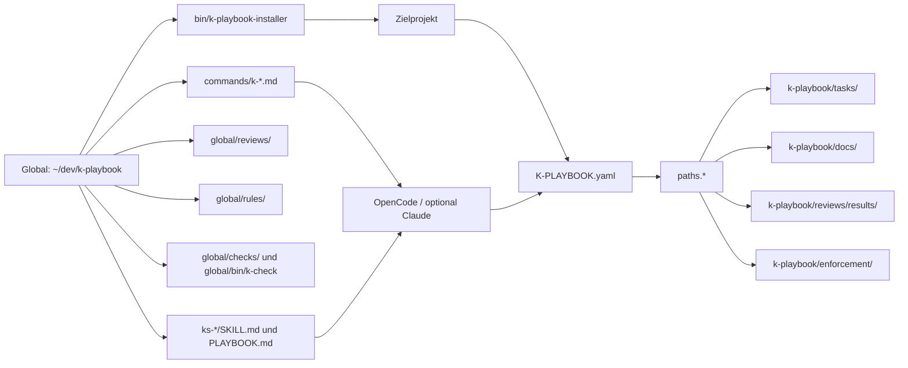
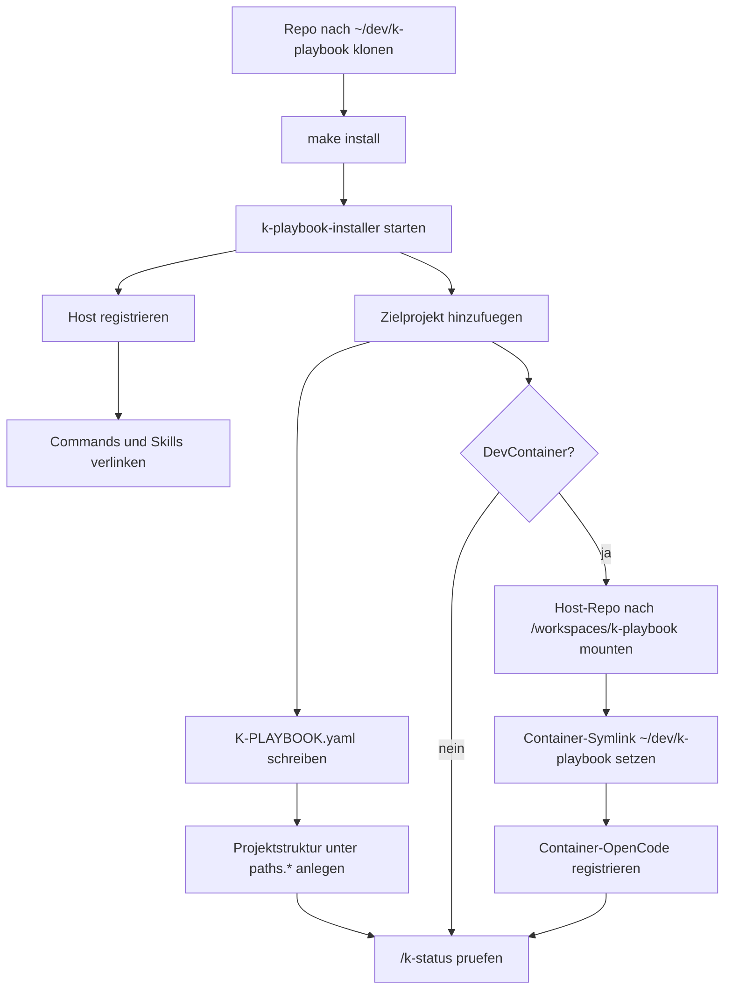
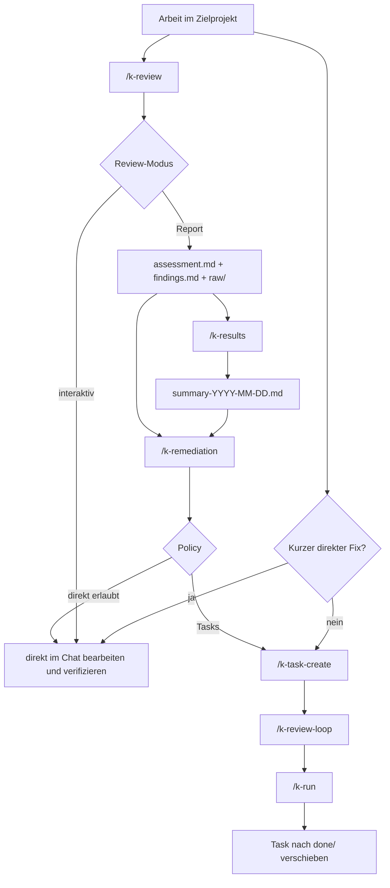

# k-playbook Handbuch

Dieses Handbuch ist die kompakte Orientierung fuer k-playbook. Detailablaeufe stehen in den verlinkten Themenseiten; diese Seite beschreibt das Gesamtmodell und die normale Reihenfolge.

## Zweck

`k-playbook` ist ein zentraler Werkzeugkasten fuer AI-Assistant-Arbeit in mehreren Entwicklungsprojekten. Die Basisinstallation liegt einmal unter `~/dev/k-playbook`; Zielprojekte enthalten nur ihre eigene Konfiguration und Artefakte.

Das Ziel ist kontrollierte, nachvollziehbare und wiederholbare Assistant-Arbeit:

- Host-Installation und Projekt-Setup sauber trennen.
- Slash-Commands, Skills, Review-Rezepte, Regeln und Checks zentral aktualisieren.
- Projektlokale Docs, Tasks, Reviews und Results in festen Pfaden ablegen.
- Review-, Task- und Remediation-Flows auditierbar machen.
- Docs als erste Quelle fuer spaetere AI-Sessions verankern.

## Grundmodell



Wichtig ist die Trennung:

| Ebene | Ort | Inhalt |
|---|---|---|
| Global | `~/dev/k-playbook/` | Commands, Skills, globale Regeln, globale Reviews, globale Checks, Installer. |
| Projektlokal | Zielprojekt | `K-PLAYBOOK.yaml` plus Artefakte unter den konfigurierten `paths.*`. |
| Host/User | Home-Verzeichnis | OpenCode-/Claude-Registrierung, Security-Tools, Installer-Launcher. |

`K-PLAYBOOK.yaml` ist die zentrale Projektkonfiguration. Commands lesen benoetigte Pfade aus `paths.*`; sie duerfen fehlende Pfade nicht aus dem Dateisystem raten. Das genaue Format steht in [`k-playbook-format.md`](./k-playbook-format.md).

## Installation Und Projekt-Onboarding

Der empfohlene Einstieg ist:

```bash
git clone git@github.com:kascada/k-playbook.git ~/dev/k-playbook
cd ~/dev/k-playbook
make install
k-playbook-installer
```

Falls der `PATH` noch nicht neu geladen ist:

```bash
~/dev/k-playbook/bin/k-playbook-installer
```

Die Installer-GUI ist der normale Weg fuer Host-Registrierung und Projekt-Onboarding. Sie prueft den Pfadvertrag `~/dev/k-playbook`, registriert OpenCode-/Claude-Commands und Skills, verwaltet Zielprojekte, schreibt `K-PLAYBOOK.yaml`, vervollstaendigt die projektlokale Struktur und kann DevContainer-Integration einrichten.



Details stehen in [`installation.md`](./installation.md) und [`multi-project-installation.md`](./multi-project-installation.md).

## Wichtige Commands

Der vollstaendige Command-Index steht in [`commands.md`](./commands.md). Die wichtigsten Gruppen sind:

| Gruppe | Commands | Zweck |
|---|---|---|
| Projekt und GUI | `/k-gui`, `/k-status` | Installer-GUI starten, Projekt- und Host-Registrierung pruefen. |
| Tool-Installation | `/k-install-security-tools`, `/k-install-codeql` | Host-/user-lokale Tools installieren oder pruefen, nicht in Projekt-venvs. |
| Docs | `/k-code2docs`, `/k-tools-scan` | Projektwissen fuer AI-Sessions dokumentieren und registrieren. |
| Code-Review | `/k-pr-review`, `/k-review`, `/k-results`, `/k-remediation` | PRs bewerten, Review-Rezepte ausfuehren, Findings priorisieren und Abarbeitung planen. |
| Task-Flow | `/k-task-create`, `/k-review-loop`, `/k-run` | Geplante Arbeit als Task-Dateien erstellen, pruefen und sequenziell ausfuehren. |
| Checks und Hilfen | `/k-enforcement`, `/k-test-check`, `/k-verlauf`, `/k-vscode-project-color` | Regeln pruefen, Tests diagnostizieren, alte Verlaeufe lesen, VS-Code markieren. |

Neue oder geaenderte Commands werden erst nach aktualisierter Assistant-Registrierung und Assistant-Neustart sichtbar.

## Arbeitsflows



### Task-Flow

Der Task-Flow ist fuer geplante Arbeit, die nicht in einem kurzen Chat-Schritt erledigt werden soll:

```text
/k-task-create
/k-review-loop
/k-run
```

Tasks koennen direkt aus dem Gespraech entstehen oder von `/k-remediation` erzeugt werden. Details stehen in [`task-flow.md`](./task-flow.md).

### Code-Review-Flow

Report-Reviews erzeugen auditierbare Result-Artefakte und fuehren bei Bedarf in Remediation:

```text
/k-review <name>
/k-results
/k-remediation <summary-or-assessment>
/k-review-loop
/k-run
```

Der komplette Flow inklusive detailliertem Schaubild steht in [`code-review.md`](./code-review.md). Das Artefaktmodell fuer `assessment.md`, `findings.md`, `raw/` und `run-metadata.json` steht in [`reviews-and-results.md`](./reviews-and-results.md).

### Docs-First

Fuer Zielprojekte soll relevantes Projektwissen unter `paths.docs` liegen und fuer AI-Sessions registriert sein:

```text
/k-code2docs
/k-tools-scan
```

`/k-code2docs` erzeugt oder aktualisiert den Docs-Index und registriert `AGENTS.md` plus OpenCode-Konfiguration. Danach den Assistant neu starten, damit neue Session-Memory greift.

## Projektstruktur

Die GUI legt konventionell diese projektlokalen Pfade an, die tatsaechlichen Werte kommen aber aus `K-PLAYBOOK.yaml`:

```text
k-playbook/tasks/
k-playbook/tasks/done/
k-playbook/TODO.md
k-playbook/checks/
k-playbook/reviews/
k-playbook/guidelines/
k-playbook/enforcement/
k-playbook/docs/
```

Typische `paths.*`-Bedeutung:

| Pfad | Zweck |
|---|---|
| `paths.tasks` | offene Task-Dateien fuer `/k-task-create`, `/k-review-loop`, `/k-run`. |
| `paths.completed_tasks` | erledigte Tasks. |
| `paths.reviews` | Review-Rezepte, Logs, `known-decisions.md`, Results. |
| `paths.checks` | projektlokale Checks fuer `global/bin/k-check`. |
| `paths.enforcement` | projektlokale Enforcement-Regeln. |
| `paths.docs` | projektlokale Docs fuer Docs-First-AI-Sessions. |

## Regeln Und Checks

Globale Regeln liegen unter `global/rules/` und projektlokale Regeln unter `paths.enforcement`. Sie werden nicht automatisch auf jede Arbeit in diesem Basis-Repo angewendet; in Zielprojekten werden sie durch Skill `ks-enforcement` oder `/k-enforcement` explizit genutzt.

`global/bin/k-check` ist kein Slash-Command, sondern ein wiederverwendbarer CLI-Runner fuer globale und projektlokale `.sh`-Checks:

```bash
~/dev/k-playbook/global/bin/k-check --mode changed
~/dev/k-playbook/global/bin/k-check --mode baseline
```

Details stehen in [`../global/checks/README.md`](../global/checks/README.md) und [`../global/rules/README.md`](../global/rules/README.md).

## Betriebsregeln

- `~/dev/k-playbook` ist der feste logische Pfad zur globalen Basisinstallation.
- Physisch abweichende Repo-Orte werden per Symlink abgebildet, nicht in Projektkonfigurationen verewigt.
- `K-PLAYBOOK.yaml` ist Konfiguration, keine User-Dokumentation.
- Projektpfade werden aus `K-PLAYBOOK.yaml` gelesen und nicht geraten.
- Host-/Security-Tools werden nicht in Projekt-venvs installiert.
- Review-Rohdaten und Run-Metadaten sind auditierbar und werden nicht still ueberschrieben.
- Groessere Remediation laeuft ueber Tasks, wenn die Projekt-Policy das verlangt.
- Nach Command-/Skill-Registrierung oder Config-Aenderungen den Assistant neu starten.

## Weiterfuehrende Docs

| Thema | Dokument |
|---|---|
| Dokumentationsindex | [`README.md`](./README.md) |
| Installation und Pfadvertrag | [`installation.md`](./installation.md) |
| Mehrere Projekte und DevContainer | [`multi-project-installation.md`](./multi-project-installation.md) |
| Commands | [`commands.md`](./commands.md) |
| Projektkonfiguration | [`k-playbook-format.md`](./k-playbook-format.md) |
| Code-Review-Flow | [`code-review.md`](./code-review.md) |
| PR-Review | [`pr-review.md`](./pr-review.md) |
| Task-Flow | [`task-flow.md`](./task-flow.md) |
| Review-Artefakte | [`reviews-and-results.md`](./reviews-and-results.md) |
| FAQ | [`faq.md`](./faq.md) |
