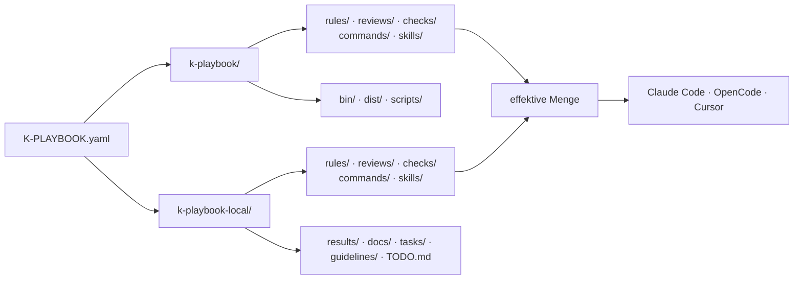
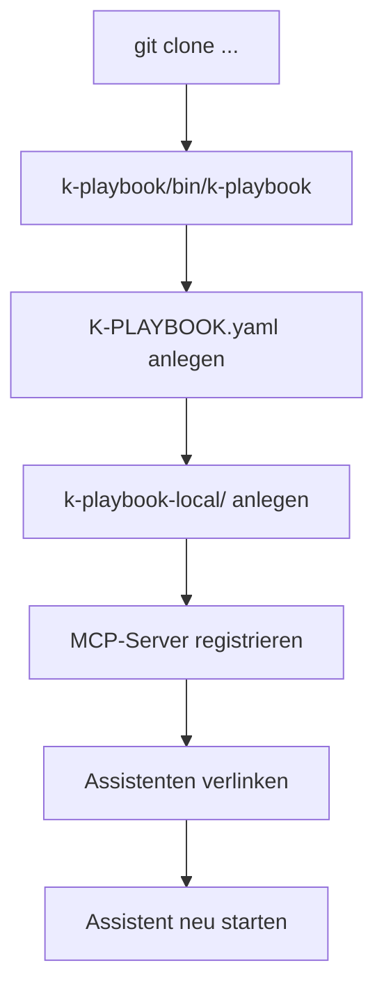
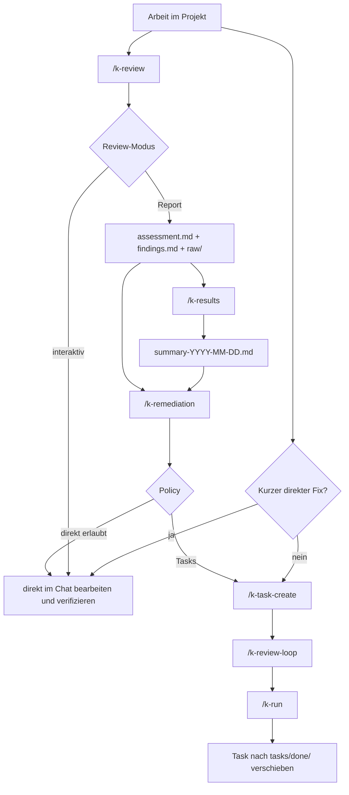

# Handbuch

Dieses Handbuch ist die kompakte Orientierung für k-playbook. Es beschreibt das
Gesamtmodell und die normale Reihenfolge; Detailabläufe stehen in den verlinkten
Themenseiten.

## Zweck

`k-playbook` ist ein Werkzeugkasten für AI-Assistant-Arbeit: Slash-Commands, Skills,
Review-Rezepte, Regeln und Checks. Er wird in ein Unterverzeichnis des Projekts geklont,
das er begleiten soll, und liegt dort neben den projekteigenen Artefakten.

Das Ziel ist kontrollierte, nachvollziehbare und wiederholbare Assistant-Arbeit:

- Mitgeliefertes und Projekteigenes sauber trennen.
- Commands, Skills, Review-Rezepte, Regeln und Checks per `git pull` aktualisieren.
- Tasks, Reviews und Ergebnisse an festen Orten ablegen.
- Review-, Task- und Remediation-Flows auditierbar machen.
- Docs als erste Quelle für spätere AI-Sessions verankern.

## Grundmodell

Ein Projekt besteht aus drei Teilen, die sich nie überlappen:

```text
projekt/
├── K-PLAYBOOK.yaml       der Anker; sein Ort bestimmt das Hauptverzeichnis
├── k-playbook/           die Installation, vollständig ersetzbar
└── k-playbook-local/     projekteigen, committed
```

| Teil | Wem gehört es | Was passiert beim Update |
|---|---|---|
| `K-PLAYBOOK.yaml` | dem Projekt | bleibt unberührt |
| `k-playbook/` | k-playbook | wird vollständig ersetzt |
| `k-playbook-local/` | dem Projekt | bleibt unberührt |

Weil die Konfiguration **neben** und nicht **in** der Installation liegt, enthält
`k-playbook/` nichts Projekteigenes. Genau deshalb ist es komplett updatebar.



### Pfade ergeben sich, sie stehen nicht in der Config

Es gibt keinen `paths:`-Block mehr. Jeder Ort leitet sich aus der Lage der
`K-PLAYBOOK.yaml` ab: Tasks liegen unter `k-playbook-local/tasks/`, Ergebnisse unter
`k-playbook-local/results/`, Projektwissen unter `k-playbook-local/docs/`, mitgelieferte
Regeln unter `k-playbook/rules/`. Ein Command rät damit keinen Pfad und liest auch
keinen — er leitet ihn ab.

Die vollständige Zuordnung steht in [`k-playbook-format.md`](./k-playbook-format.md).

### Mitgeliefertes und Projekteigenes zusammenfassen

Fünf Verzeichnisse existieren doppelt: `rules/`, `reviews/`, `checks/`, `commands/` und
`skills/`. Was gilt, ist die Vereinigung beider Seiten. **Bei gleichem Namen gewinnt der
projekteigene Eintrag, und zwar vollständig** — der mitgelieferte wird dann gar nicht
erst gelesen.

Abgeschaltet wird über einen **leeren** lokalen Eintrag: nichts außer Leerzeilen und
Kommentaren. Damit kann die Datei ihren eigenen Grund tragen, und es braucht keine Liste
in der Konfiguration.

Bei Commands und Skills folgt daraus, wie die Assistenten verlinkt werden: `.claude/commands`
und die drei anderen Ziele sind echte Verzeichnisse mit **einem Symlink je Eintrag**. Ein
Verzeichnis-Symlink zeigt auf genau eine Quelle und könnte die zweite nie erreichen.

### Eine Antwort, nicht viele

Was am Ende gilt, rechnet nicht jeder Command selbst aus:

```bash
k-playbook/bin/k-playbook context
```

Das Kommando gibt den aufgelösten Arbeitsstand als JSON aus — Verzeichnisse,
Instruktionsdateien in Lesereihenfolge, Remediation-Policy, Guidelines und die drei
Kataloge, bereits zusammengeführt, mit Herkunft je Eintrag und markierten Abschaltungen.

Dieselbe Auskunft gibt es für einen Assistenten auch als Werkzeug:
`k-playbook/bin/k-playbook mcp` startet einen MCP-Server, dessen einziges Werkzeug den
Arbeitsstand zurückgibt. Gedacht ist das für den Aufruf durch den Assistenten, nicht für
die Hand — auf der Kommandozeile bleibt `context` der Weg.

Eine Antwort heißt auch: einmal je Sitzung. Die Ausgabe ändert sich während der Arbeit
nicht, also holt der nächste Command sie nicht erneut, sondern arbeitet mit der
vorhandenen weiter. Neu geholt wird sie erst, wenn die `K-PLAYBOOK.yaml` geschrieben
wurde, sich der Bestand an Regeln, Reviews, Checks oder Guidelines geändert hat oder die
Arbeit in ein anderes Projekt gewechselt ist.

### Instruktionen in zwei Ebenen

| Datei | Gilt für | Beim Update |
|---|---|---|
| `k-playbook/k-playbook.md` | jedes Projekt, das k-playbook nutzt | wird ersetzt |
| `k-playbook-local/k-playbook.md` | nur dieses Projekt | bleibt |

Gelesen wird in dieser Reihenfolge; die projekteigene Ebene ergänzt die mitgelieferte
oder überstimmt sie. `AGENTS.md` im Hauptverzeichnis bekommt nur einen kurzen Anstoß,
der auf `k-playbook context` verweist — vorhandener Inhalt bleibt unangetastet.

## Installation

```bash
cd /pfad/zum/projekt
git clone git@github.com:kascada/k-playbook.git
k-playbook/bin/k-playbook
```

Go wird nicht gebraucht — die Binaries liegen fertig im Repo. Der letzte Aufruf startet
die Oberfläche, die durch vier Schritte führt: Konfiguration anlegen, projekteigene
Struktur anlegen, MCP-Server registrieren, Assistenten verlinken. Geschrieben wird jeweils
erst nach Bestätigung.



Details stehen in [`installation.md`](./installation.md).

## Wichtige Commands

Der vollständige Index steht in [`commands.md`](./commands.md). Die Gruppen:

| Gruppe | Commands | Zweck |
|---|---|---|
| Projekt | `/k-gui` | Oberfläche starten, Projektzustand prüfen und einrichten |
| Docs | `/k-code2docs`, `/k-tools-scan`, `/k-docs-extract`, `/k-docs-index` | Projektwissen je Herkunft dokumentieren und für AI-Sessions registrieren |
| Code-Review | `/k-pr-review`, `/k-review`, `/k-results`, `/k-remediation` | PRs bewerten, Reviews ausführen, Findings priorisieren und abarbeiten |
| Task-Flow | `/k-task-create`, `/k-review-loop`, `/k-run`, `/k-todo` | geplante Arbeit erstellen, prüfen und ausführen |
| Hilfen | `/k-enforcement`, `/k-test-check`, `/k-verlauf`, `/k-vscode-project-color` | Regeln prüfen, Tests diagnostizieren, Verläufe lesen, VS Code markieren |

Neue oder geänderte Commands werden erst nach einem Neustart des Assistenten sichtbar.

## Arbeitsflows



### Task-Flow

Für geplante Arbeit, die nicht in einem kurzen Chat-Schritt erledigt werden soll:

```text
/k-task-create
/k-review-loop
/k-run
```

Tasks entstehen direkt aus dem Gespräch oder aus `/k-remediation`. Details stehen in
[`task-flow.md`](./task-flow.md).

### Code-Review-Flow

Report-Reviews erzeugen auditierbare Artefakte und führen bei Bedarf in Remediation:

```text
/k-review <name>
/k-results
/k-remediation <summary-oder-assessment>
/k-review-loop
/k-run
```

Der komplette Flow steht in [`code-review.md`](./code-review.md), das Artefaktmodell in
[`reviews-and-results.md`](./reviews-and-results.md).

### Docs-First

Projektwissen soll dokumentiert und für AI-Sessions registriert sein. Der Ablauf ist
vierstufig, und jede Stufe schreibt ausschließlich in ihr eigenes Verzeichnis:

```text
/k-code2docs      → k-playbook-local/docs/code/
/k-tools-scan     → k-playbook-local/docs/libs/
/k-docs-extract   → k-playbook-local/docs/extracted/
/k-docs-index     → k-playbook-local/docs/README.md + AGENTS.md + opencode.json
```

Die ersten drei erzeugen Inhalt: `/k-code2docs` liest den Code, `/k-tools-scan` die
Libraries, `/k-docs-extract` das Rohmaterial aus `k-playbook-local/material/`. Wer nichts
davon hat, lässt die Stufe aus.

`/k-docs-index` ist der letzte Schritt und der einzige, der `docs/README.md` schreibt —
den einen Index über alle Herkünfte, `docs/manual/` eingeschlossen. Er registriert die
Docs außerdem in `AGENTS.md` und `opencode.json`. Danach den Assistenten neu starten,
damit die neue Session-Memory greift.

Jedes Unterverzeichnis von `docs/` hat genau einen Erzeuger. In `docs/manual/` schreibt
kein Command Doc-Dateien; was ein Projekt sonst noch an Dokumentation pflegt, bleibt
ebenfalls unberührt — k-playbook beansprucht nur sein eigenes Verzeichnis.

## Regeln und Checks

Mitgelieferte Regeln liegen unter `k-playbook/rules/`, projekteigene unter
`k-playbook-local/rules/`. Sie werden nicht automatisch auf jede Arbeit angewendet: der
Skill `enforcement` oder der Command `/k-enforcement` zieht sie ausdrücklich heran.

`k-playbook/bin/k-check` ist kein Slash-Command, sondern ein CLI-Runner für die
effektive Check-Menge aus mitgelieferten und projekteigenen `.sh`-Checks:

```bash
k-playbook/bin/k-check --mode changed
k-playbook/bin/k-check --mode baseline
```

Details stehen in [`../checks/README.md`](../checks/README.md) und
[`../rules/README.md`](../rules/README.md).

## Betriebsregeln

- Jedes Projekt trägt seine eigene Installation. Kein fester Hostpfad, kein globaler Symlink.
- `k-playbook/` wird bei jedem Update vollständig ersetzt; alles daneben nie angefasst.
- Mitgelieferte Regeln, Reviews und Checks werden nicht editiert. Ein Projekt weicht per
  Overlay ab: gleichnamige lokale Datei ersetzt, eine leere schaltet ab.
- Pfade werden abgeleitet, nicht geraten und nicht konfiguriert.
- `K-PLAYBOOK.yaml` ist Konfiguration, keine Dokumentation. Eine vorhandene Datei wird
  nie überschrieben.
- Security-Tools werden host- oder user-lokal installiert, nie in Projekt-venvs.
- Review-Rohdaten und Run-Metadaten sind auditierbar und werden nicht still überschrieben.
- Größere Remediation läuft über Tasks, wenn die Projekt-Policy das verlangt.
- Nach Änderungen an Commands oder Skills den Assistenten neu starten.

## Weiterführende Docs

| Thema | Dokument |
|---|---|
| Dokumentationsindex | [`README.md`](./README.md) |
| Installation | [`installation.md`](./installation.md) |
| Commands | [`commands.md`](./commands.md) |
| Projektkonfiguration | [`k-playbook-format.md`](./k-playbook-format.md) |
| Code-Review-Flow | [`code-review.md`](./code-review.md) |
| PR-Review | [`pr-review.md`](./pr-review.md) |
| Task-Flow | [`task-flow.md`](./task-flow.md) |
| Review-Artefakte | [`reviews-and-results.md`](./reviews-and-results.md) |
| FAQ | [`faq.md`](./faq.md) |
