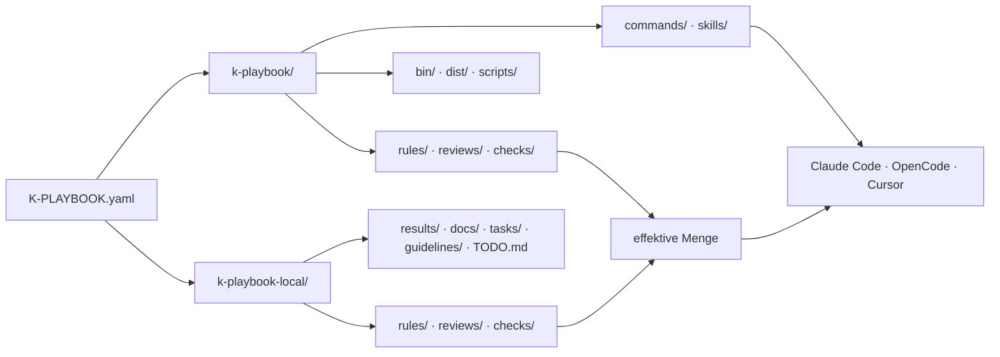
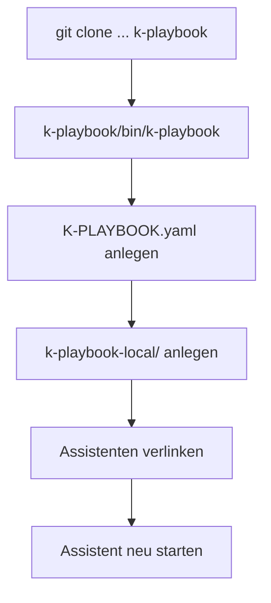
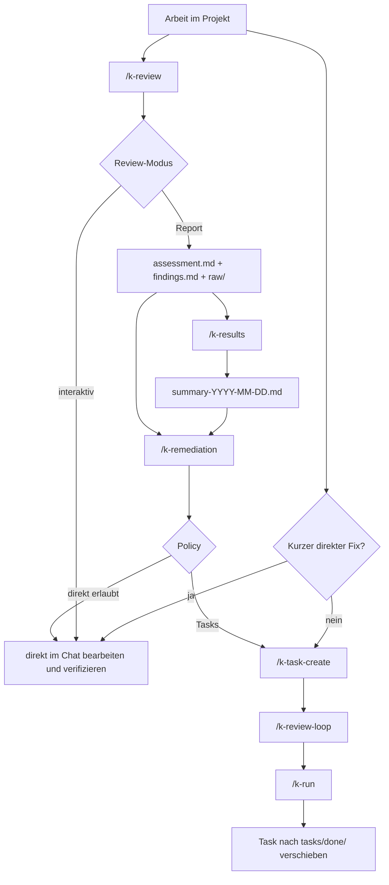

# Handbuch

Dieses Handbuch ist die kompakte Orientierung fuer k-playbook. Es beschreibt das
Gesamtmodell und die normale Reihenfolge; Detailablaeufe stehen in den verlinkten
Themenseiten.

## Zweck

`k-playbook` ist ein Werkzeugkasten fuer AI-Assistant-Arbeit: Slash-Commands, Skills,
Review-Rezepte, Regeln und Checks. Er wird in ein Unterverzeichnis des Projekts geklont,
das er begleiten soll, und liegt dort neben den projekteigenen Artefakten.

Das Ziel ist kontrollierte, nachvollziehbare und wiederholbare Assistant-Arbeit:

- Mitgeliefertes und Projekteigenes sauber trennen.
- Commands, Skills, Review-Rezepte, Regeln und Checks per `git pull` aktualisieren.
- Tasks, Reviews und Ergebnisse an festen Orten ablegen.
- Review-, Task- und Remediation-Flows auditierbar machen.
- Docs als erste Quelle fuer spaetere AI-Sessions verankern.

## Grundmodell

Ein Projekt besteht aus drei Teilen, die sich nie ueberlappen:

```text
projekt/
├── K-PLAYBOOK.yaml       der Anker; sein Ort bestimmt das Hauptverzeichnis
├── k-playbook/           die Installation, vollstaendig ersetzbar
└── k-playbook-local/     projekteigen, committed
```

| Teil | Wem gehoert es | Was passiert beim Update |
|---|---|---|
| `K-PLAYBOOK.yaml` | dem Projekt | bleibt unberuehrt |
| `k-playbook/` | k-playbook | wird vollstaendig ersetzt |
| `k-playbook-local/` | dem Projekt | bleibt unberuehrt |

Weil die Konfiguration **neben** und nicht **in** der Installation liegt, enthaelt
`k-playbook/` nichts Projekteigenes. Genau deshalb ist es komplett updatebar.



### Pfade ergeben sich, sie stehen nicht in der Config

Es gibt keinen `paths:`-Block mehr. Jeder Ort leitet sich aus der Lage der
`K-PLAYBOOK.yaml` ab: Tasks liegen unter `k-playbook-local/tasks/`, Ergebnisse unter
`k-playbook-local/results/`, Projektwissen unter `k-playbook-local/docs/`, mitgelieferte
Regeln unter `k-playbook/rules/`. Ein Command raet damit keinen Pfad und liest auch
keinen — er leitet ihn ab.

Die vollstaendige Zuordnung steht in [`k-playbook-format.md`](./k-playbook-format.md).

### Mitgeliefertes und Projekteigenes zusammenfassen

Drei Verzeichnisse existieren doppelt: `rules/`, `reviews/` und `checks/`. Was gilt, ist
die Vereinigung beider Seiten. **Bei gleichem Dateinamen gewinnt die projekteigene Datei,
und zwar vollstaendig** — die mitgelieferte wird dann gar nicht erst gelesen.

Abgeschaltet wird ueber eine **leere** lokale Datei: nichts ausser Leerzeilen und
Kommentaren. Damit kann die Datei ihren eigenen Grund tragen, und es braucht keine Liste
in der Konfiguration.

Commands und Skills gibt es nur mitgeliefert.

### Eine Antwort, nicht viele

Was am Ende gilt, rechnet nicht jeder Command selbst aus:

```bash
k-playbook/bin/k-playbook context
```

Das Kommando gibt den aufgeloesten Arbeitsstand als JSON aus — Verzeichnisse,
Instruktionsdateien in Lesereihenfolge, Remediation-Policy, Guidelines und die drei
Kataloge, bereits zusammengefuehrt, mit Herkunft je Eintrag und markierten Abschaltungen.

### Instruktionen in zwei Ebenen

| Datei | Gilt fuer | Beim Update |
|---|---|---|
| `k-playbook/k-playbook.md` | jedes Projekt, das k-playbook nutzt | wird ersetzt |
| `k-playbook-local/k-playbook.md` | nur dieses Projekt | bleibt |

Gelesen wird in dieser Reihenfolge; die projekteigene Ebene ergaenzt die mitgelieferte
oder ueberstimmt sie. `AGENTS.md` im Hauptverzeichnis bekommt nur einen kurzen Anstoss,
der auf `k-playbook context` verweist — vorhandener Inhalt bleibt unangetastet.

## Installation

```bash
cd /pfad/zum/projekt
git clone git@github.com:kascada/k-playbook.git k-playbook
k-playbook/bin/k-playbook
```

Go wird nicht gebraucht — die Binaries liegen fertig im Repo. Der letzte Aufruf startet
die Oberflaeche, die durch drei Schritte fuehrt: Konfiguration anlegen, projekteigene
Struktur anlegen, Assistenten verlinken. Geschrieben wird jeweils erst nach Bestaetigung.



Details stehen in [`installation.md`](./installation.md).

## Wichtige Commands

Der vollstaendige Index steht in [`commands.md`](./commands.md). Die Gruppen:

| Gruppe | Commands | Zweck |
|---|---|---|
| Projekt | `/k-gui`, `/k-status` | Oberflaeche starten, Projektzustand pruefen |
| Tools | `/k-install-codeql`, `/k-setup-codeql` | CodeQL installieren bzw. die Projektentscheidung festhalten |
| Docs | `/k-code2docs`, `/k-tools-scan` | Projektwissen fuer AI-Sessions dokumentieren |
| Code-Review | `/k-pr-review`, `/k-review`, `/k-results`, `/k-remediation` | PRs bewerten, Reviews ausfuehren, Findings priorisieren und abarbeiten |
| Task-Flow | `/k-task-create`, `/k-review-loop`, `/k-run`, `/k-todo` | geplante Arbeit erstellen, pruefen und ausfuehren |
| Hilfen | `/k-enforcement`, `/k-test-check`, `/k-verlauf`, `/k-vscode-project-color` | Regeln pruefen, Tests diagnostizieren, Verlaeufe lesen, VS Code markieren |

Neue oder geaenderte Commands werden erst nach einem Neustart des Assistenten sichtbar.

## Arbeitsflows



### Task-Flow

Fuer geplante Arbeit, die nicht in einem kurzen Chat-Schritt erledigt werden soll:

```text
/k-task-create
/k-review-loop
/k-run
```

Tasks entstehen direkt aus dem Gespraech oder aus `/k-remediation`. Details stehen in
[`task-flow.md`](./task-flow.md).

### Code-Review-Flow

Report-Reviews erzeugen auditierbare Artefakte und fuehren bei Bedarf in Remediation:

```text
/k-review <name>
/k-results
/k-remediation <summary-oder-assessment>
/k-review-loop
/k-run
```

Der komplette Flow steht in [`code-review.md`](./code-review.md), das Artefaktmodell in
[`reviews-and-results.md`](./reviews-and-results.md).

### Docs-First

Projektwissen soll dokumentiert und fuer AI-Sessions registriert sein:

```text
/k-code2docs
/k-tools-scan
```

`/k-code2docs` schreibt nach `k-playbook-local/docs/`, erzeugt oder aktualisiert den
Docs-Index und registriert `AGENTS.md`. `/k-tools-scan` legt Tool-Steckbriefe unter
`k-playbook-local/docs/libs/` ab. Danach den Assistenten neu starten, damit die neue
Session-Memory greift.

Was ein Projekt sonst noch an Dokumentation pflegt, bleibt davon unberuehrt — k-playbook
beansprucht nur sein eigenes Verzeichnis.

## Regeln und Checks

Mitgelieferte Regeln liegen unter `k-playbook/rules/`, projekteigene unter
`k-playbook-local/rules/`. Sie werden nicht automatisch auf jede Arbeit angewendet: der
Skill `enforcement` oder der Command `/k-enforcement` zieht sie ausdruecklich heran.

`k-playbook/bin/k-check` ist kein Slash-Command, sondern ein CLI-Runner fuer die
effektive Check-Menge aus mitgelieferten und projekteigenen `.sh`-Checks:

```bash
k-playbook/bin/k-check --mode changed
k-playbook/bin/k-check --mode baseline
```

Details stehen in [`../checks/README.md`](../checks/README.md) und
[`../rules/README.md`](../rules/README.md).

## Betriebsregeln

- Jedes Projekt traegt seine eigene Installation. Kein fester Hostpfad, kein globaler Symlink.
- `k-playbook/` wird bei jedem Update vollstaendig ersetzt; alles daneben nie angefasst.
- Mitgelieferte Regeln, Reviews und Checks werden nicht editiert. Ein Projekt weicht per
  Overlay ab: gleichnamige lokale Datei ersetzt, eine leere schaltet ab.
- Pfade werden abgeleitet, nicht geraten und nicht konfiguriert.
- `K-PLAYBOOK.yaml` ist Konfiguration, keine Dokumentation. Eine vorhandene Datei wird
  nie ueberschrieben.
- Security-Tools werden host- oder user-lokal installiert, nie in Projekt-venvs.
- Review-Rohdaten und Run-Metadaten sind auditierbar und werden nicht still ueberschrieben.
- Groessere Remediation laeuft ueber Tasks, wenn die Projekt-Policy das verlangt.
- Nach Aenderungen an Commands oder Skills den Assistenten neu starten.

## Weiterfuehrende Docs

| Thema | Dokument |
|---|---|
| Dokumentationsindex | [`README.md`](./README.md) |
| Installation | [`installation.md`](./installation.md) |
| Commands | [`commands.md`](./commands.md) |
| Projektkonfiguration | [`k-playbook-format.md`](./k-playbook-format.md) |
| Code-Review-Flow | [`code-review.md`](./code-review.md) |
| PR-Review | [`pr-review.md`](./pr-review.md) |
| Task-Flow | [`task-flow.md`](./task-flow.md) |
| Review-Artefakte | [`reviews-and-results.md`](./reviews-and-results.md) |
| FAQ | [`faq.md`](./faq.md) |
