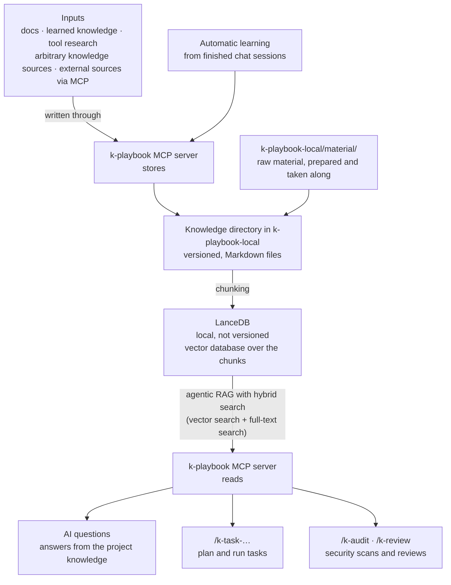

# Knowledge Storage

Where knowledge flows, from the source to its use by the AI. Parts of this are
still being built; the diagram shows what it is heading towards.

**LanceDB is deferred.** The measurements in `knowledge-gate.md` put the expected corpus at
a few thousand chunks, which the in-process index handles without a database of its own.
The diagram keeps it as the far end of the road, not as the next step: if the corpus or the
retrieval quality ever demands it, the contract is built so it can be slotted in without
changing a caller. Until then the chunks are indexed in the Go process.

The concept underneath this diagram — how a deposit is classified, what the query surface
looks like, and which decisions rest on which measurements — is in
[`knowledge-gate.md`](knowledge-gate.md).

## Automatic learning

A chat session produces knowledge that nobody writes down. When a session ends,
it is examined for what is worth keeping, and the result enters the store
through the MCP server like every other input — as versioned Markdown, chunked
into the index, retrievable in the next session.

Two kinds of finding qualify:

- **Facts about the code** that the knowledge base does not hold yet: how a
  component actually behaves, why a construct is the way it is, which
  assumption turned out to be wrong.
- **Methods for achieving something**: the sequence of steps that worked, the
  command that answered a question, the detour that was not needed after all.

What already exists is not written again. The extraction compares against the
knowledge base first and keeps only the delta, so a recurring topic does not
accumulate near-duplicates. Everything else the session produced — the
conversation itself, one-off details, anything tied to the moment — is dropped.
