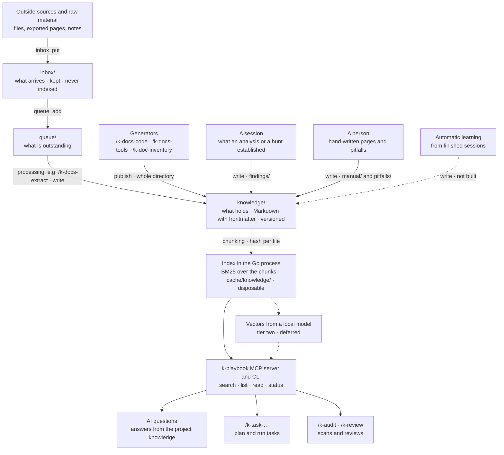

# Knowledge Storage

Where knowledge flows, from the source to its use by the AI. This page is the picture. The
entry page for the knowledge store — why it exists, what is built, how we proceed — is
[`knowledge-gate.md`](knowledge-gate.md); the zones and the write tools are defined in
[`knowledge-layout.md`](knowledge-layout.md).

Solid lines are built. Dashed lines are planned or deliberately deferred.

**Today `knowledge/` is empty in every project.** The documents still live in `docs/` until
the migration moves them; the order of the steps is in
[`knowledge-gate.md`](knowledge-gate.md), "How we proceed".

**No database of its own.** The measurements in `knowledge-gate.md` put the expected corpus
at a few thousand chunks, which the index in the Go process handles without effort. LanceDB,
which an earlier version of this diagram drew at the end of the road, is deferred and
revisited only if the corpus or the retrieval quality demands it. The response contract is
built so that vectors or a database can be slotted in without changing a caller.

## Automatic learning

**Status: concept, not built.** When it is, it writes into `knowledge/findings/` through the
same tool as every other deposit.

A chat session produces knowledge that nobody writes down. When a session ends,
it is examined for what is worth keeping, and the result enters the store
through the MCP server like every other input — as versioned Markdown, chunked
into the index, retrievable in the next session.

Two kinds of finding qualify:

- **Facts about the code** that the knowledge base does not hold yet: how a
  component actually behaves, why a construct is the way it is, which
  assumption turned out to be wrong.
- **Methods for achieving something**: the sequence of steps that worked, the
  command that answered a question, the detour that was not needed after all.

What already exists is not written again. The extraction compares against the
knowledge base first and keeps only the delta, so a recurring topic does not
accumulate near-duplicates. Everything else the session produced — the
conversation itself, one-off details, anything tied to the moment — is dropped.
