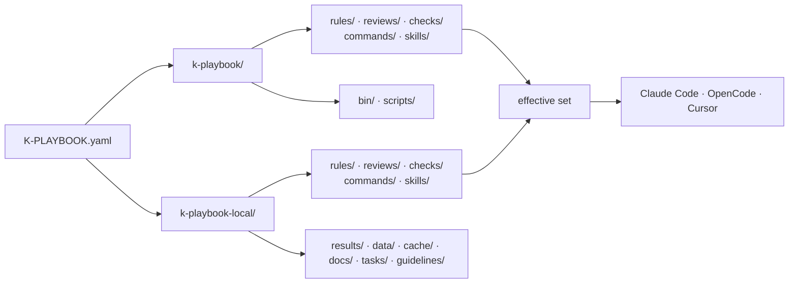
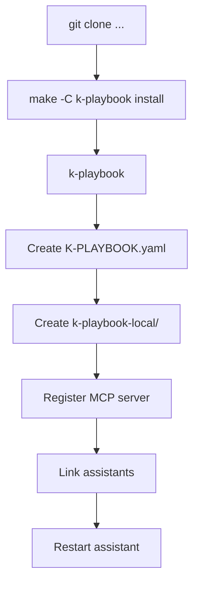
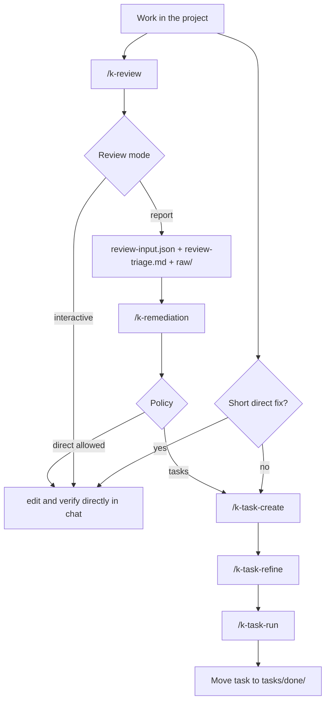

# Manual

This manual is the concise orientation for k-playbook. It describes the overall
model and normal sequence; detailed workflows are on the linked topic pages.

## Purpose

`k-playbook` is a toolkit for AI assistant work: slash commands, skills, review
recipes, rules, and checks. It is cloned into a subdirectory of the project it
supports and sits alongside the project-owned artifacts.

The goal is controlled, traceable, and repeatable assistant work:

- Keep shipped and project-owned content clearly separate.
- Update commands, skills, review recipes, rules, and checks using `git pull`.
- Store tasks, reviews, and results in fixed locations.
- Make review, task, and remediation flows auditable.
- Establish docs as the first source for later AI sessions.

## Core model

A project consists of three parts that never overlap:

```text
project/
├── K-PLAYBOOK.yaml       the anchor; its location determines the project root
├── k-playbook/           the installation, fully replaceable
└── k-playbook-local/     project-owned, committed (except the contents of results/)
```

| Part | Owner | What happens on update |
|---|---|---|
| `K-PLAYBOOK.yaml` | the project | remains untouched |
| `k-playbook/` | k-playbook | is fully replaced |
| `k-playbook-local/` | the project | remains untouched |

Because configuration is **beside**, rather than **in**, the installation,
`k-playbook/` contains nothing project-owned. That is exactly why it can be
updated completely.



### Paths are derived, not stored in config

There is no longer a `paths:` block. Every location derives from the location
of `K-PLAYBOOK.yaml`: tasks are under `k-playbook-local/tasks/`, results under
`k-playbook-local/results/`, project knowledge under `k-playbook-local/docs/`,
and shipped rules under `k-playbook/rules/`. A command therefore neither guesses
nor reads a path: it derives it.

The complete mapping is in [`k-playbook-format.md`](./k-playbook-format.md).

### Merge shipped and project-owned content

Five directories exist twice: `rules/`, `reviews/`, `checks/`, `commands/`, and
`skills/`. What applies is the union of both sides. **For the same name, the
project-owned entry wins, completely**: the shipped entry is not read at all.

Content is disabled with an **empty** local entry: nothing except blank lines
and comments. This lets the file record its own reason, without requiring a
list in the configuration.

For commands and skills, this determines how assistants are linked:
`.claude/commands` and the three other destinations are real directories with
**one symlink per entry**. A directory symlink points to exactly one source and
could never reach the second.

### One answer, not many

No command calculates what ultimately applies itself:

```bash
k-playbook context
```

The command outputs the resolved working state as JSON: directories,
instruction files in reading order, remediation policy, guidelines, and the
three catalogs, already merged, including each entry's origin and marked
disabled entries.

The same information is also available to an assistant as a tool:
`k-playbook mcp` starts an MCP server whose only tool returns the working state.
It is meant to be invoked by the assistant, not by hand; on the command line,
`context` remains the way to use it.

One answer also means once per session. The output does not change while work
is underway, so the next command does not retrieve it again but continues with
the existing result. Retrieve it again only after writing `K-PLAYBOOK.yaml`,
changing the set of rules, reviews, checks, or guidelines, or moving work to a
different project.

### Instructions at two levels

| File | Applies to | On update |
|---|---|---|
| `k-playbook/k-playbook.md` | every project using k-playbook | is replaced |
| `k-playbook-local/k-playbook.md` | this project only | remains |

They are read in this order; the project-owned level supplements or overrides
the shipped one. `AGENTS.md` in the project root receives only a short prompt
that refers to `k-playbook context`; existing content remains untouched.

## Installation

```bash
cd /path/to/project
git clone git@github.com:kascada/k-playbook.git
make -C k-playbook install
k-playbook
```

Go is not required: `bin/install` is a shell script. It downloads the release
asset for the current platform, verifies it against the shipped `SHA256SUMS`,
and installs it to `~/.local/bin/k-playbook`. This one bootstrap needs network
access, and `~/.local/bin` must be on `PATH`. The last command starts the
interface, which guides four steps: create configuration, create
project-owned structure, register the MCP server, and link assistants. Each
write happens only after confirmation.



Details are in [`installation.md`](./installation.md).

## Important commands

The complete index is in [`commands.md`](./commands.md). The groups are:

| Group | Commands | Purpose |
|---|---|---|
| Project | `/k-gui` | Start the interface, check and set up project state |
| Docs | `/k-docs`, `/k-docs-code`, `/k-docs-tools`, `/k-docs-extract`, `/k-doc-inventory`, `/k-docs-index` | Check, document, and register project knowledge by origin for AI sessions |
| Code review | `/k-pr-review`, `/k-review`, `/k-audit`, `/k-remediation` | Assess PRs, run reviews and audits, address findings |
| Task flow | `/k-task-create`, `/k-task-refine`, `/k-task-run`, `/k-todo` | Create, harden, and execute planned work |
| Utilities | `/k-enforcement`, `/k-test-check`, `/k-verlauf`, `/k-vscode-project-color` | Check rules, diagnose tests, read histories, mark VS Code |

New or changed commands become visible only after restarting the assistant.

## Workflows



### Task flow

For planned work that should not be completed in a short chat step:

```text
/k-task-create
/k-task-refine
/k-task-run
```

Tasks arise directly from the conversation or from `/k-remediation`. Details
are in [`task-flow.md`](./task-flow.md).

### Code review flow

Report reviews produce auditable artifacts and lead to remediation when needed:

```text
/k-review <name>
/k-remediation <review-triage>
/k-task-refine
/k-task-run
```

There is no additional step between assessment and handling: `review-triage.md`
is both the result and the input for `/k-remediation`. To see multiple sources
merged, use `/k-audit`; findings are consolidated there, and only there.

The complete flow and the artifact model are in
[`code-review.md`](./code-review.md).

### Docs first

Project knowledge should be documented and registered for AI sessions. The
workflow follows the origins of the docs; each tool writes exclusively to
directories of its own origin:

```text
/k-docs           → check inventory and offer possible docs actions
/k-docs-code      → k-playbook-local/docs/code/
/k-docs-tools     → k-playbook-local/docs/libs/
/k-docs-extract   → k-playbook-local/docs/extracted/
/k-doc-inventory  → k-playbook-local/docs/versions/
/k-docs-index     → k-playbook-local/docs/README.md + AGENTS.md + opencode.json
```

`/k-docs` is the guided entry point: it checks inventory, consistency, and
session memory and offers the possible next step. The four producers create
content: `/k-docs-code` reads code, `/k-docs-tools` reads libraries,
`/k-docs-extract` reads raw material from `k-playbook-local/material/`, and
`/k-doc-inventory` reads declared versions from manifests, lockfiles, container,
Helm, and CI files. Skip a stage if it has no input.
The knowledge gate -- `k-playbook knowledge` and the MCP tools
`k_playbook_knowledge_*` -- no longer reads or writes here: it works on the
knowledge store `k-playbook-local/knowledge/`, with `inbox/` and `queue/`
beside it, which are empty until the migration moves the documents (see
[knowledge-layout.md](knowledge-layout.md) and [mcp.md](mcp.md), "Knowledge
Contract").

`/k-docs-index` is the final step and the only one that writes `docs/README.md`:
the index across the generated origins and the flat root files,
`docs/manual/` included. It also registers
the docs in `AGENTS.md` and `opencode.json`, or `opencode.jsonc` if only that
file exists; it never creates a second file. Then restart the assistant so the
new session memory takes effect.

Each subdirectory of `docs/` represents an origin; a file's frontmatter records
which tool wrote it under `generated.by`. No command writes doc files in
`docs/manual/`; other documentation maintained by a project also remains
untouched. k-playbook claims only its own directory.

## Rules and checks

Shipped rules are in `k-playbook/rules/`, project-owned rules in
`k-playbook-local/rules/`. They are not automatically applied to every task:
the `enforcement` skill or `/k-enforcement` command explicitly brings them in.

`k-playbook/bin/k-check` is not a slash command but a CLI runner for the
effective set of shipped and project-owned `.sh` checks:

```bash
k-playbook/bin/k-check --mode changed
k-playbook/bin/k-check --mode baseline
```

Details are in [`../checks/README.md`](../checks/README.md) and
[`../rules/README.md`](../rules/README.md).

## Operating rules

- Each project carries its own installation. No fixed host path and no global symlink.
- `k-playbook/` is fully replaced on every update; never touch anything beside it.
- Do not edit shipped rules, reviews, or checks. A project diverges through an overlay: a same-named local file replaces it, and an empty one disables it.
- Paths are derived, not guessed or configured.
- `K-PLAYBOOK.yaml` is configuration, not documentation. An existing file is never overwritten.
- Projects may use their own venvs; security tools run separately, host/user-local or in dedicated k-playbook tool venvs.
- Review raw data and run metadata are auditable and are not silently overwritten.
- Larger remediation proceeds through tasks if project policy requires it.
- Restart the assistant after changing commands or skills.

## Further docs

| Topic | Document |
|---|---|
| Documentation index | [`README.md`](./README.md) |
| Installation | [`installation.md`](./installation.md) |
| Commands | [`commands.md`](./commands.md) |
| Project configuration | [`k-playbook-format.md`](./k-playbook-format.md) |
| Code review flow | [`code-review.md`](./code-review.md) |
| PR review | [`pr-review.md`](./pr-review.md) |
| Task flow | [`task-flow.md`](./task-flow.md) |
| FAQ | [`faq.md`](./faq.md) |
