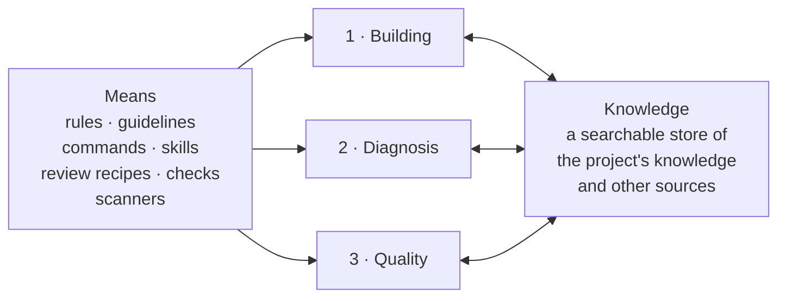
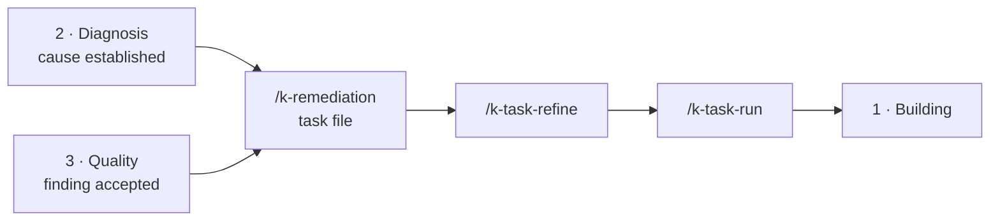
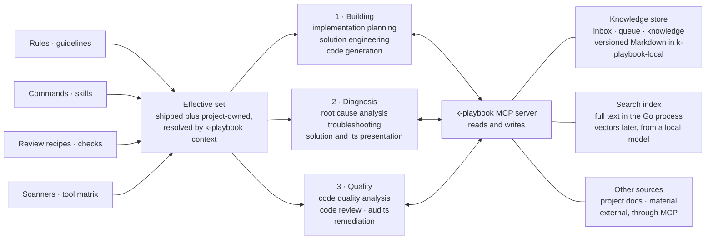

# Overview

k-playbook exists for three kinds of work. They are separate occasions with
separate flows, but they share the same two things: the same means on one side,
and the same knowledge on the other.

## The three kinds of work

**1 · Building** — implementation planning, solution engineering, code
generation. A piece of work is written down before it is done, hardened, and
only then executed: `/k-task-create`, `/k-task-refine`, `/k-task-run`. Details
in [`task-flow.md`](./task-flow.md).

**2 · Diagnosis** — a ticket or a bug arrives, the cause is looked for, the
system is troubleshot, and the solution is worked out and presented. This is the
one of the three that produces its result as an argument rather than as a
diff: what was measured, what was ruled out, how certain the finding is. It is
carried by the `ks-befunde` skill and the rule `k-playbook/rules/befunde.md`,
which write findings to `k-playbook-local/material/befunde/` while the work is
still going on, and by `/k-danke`, which presents them at the end of the session
and promotes the confirmed ones into the documentation.

**3 · Quality** — code quality analysis, code review, audits, remediation.
`/k-review` runs a single recipe, `/k-audit` orchestrates a whole sweep with
scanners, evidence recipes, merge and perspectives, `/k-pr-review` assesses a
specific pull request, and `/k-remediation` turns the findings into work.
Details in [`code-review.md`](./code-review.md) and
[`review-runs.md`](./review-runs.md).

### The way back

Two of the three do not end at a report. What diagnosis establishes as a cause,
and what a review leaves standing as an accepted finding, becomes a task file and
re-enters the building flow:

## The means, on the left

Rules, guidelines, commands, skills, review recipes, checks and the scanner
matrix are not owned by any one of the three. They exist once and apply to all
of them. Every one of these kinds exists twice — shipped under `k-playbook/` and
project-owned under `k-playbook-local/` — and what actually applies is the union,
with the project-owned entry winning for the same name.

Nothing works this out for itself. `k-playbook context` resolves it once per
session and hands out the same answer to every command: the directories, the
instruction files in read order, and the three catalogs with `dist`, `local` and
`override` already merged. The core model behind it is in
[`manual.md`](./manual.md#core-model), the contract in
[`k-playbook-format.md`](./k-playbook-format.md).

## The knowledge store, on the right

All three draw on the same store, and all three feed it. It holds what the
project knows — generated code documentation, tool and library pitfalls, the
version inventory, extracted material, findings from earlier sessions — as
versioned Markdown in `k-playbook-local`, reachable through a search index in the
Go process — full text today, vectors from a local model as a later tier — and open
to further sources through MCP.

This is what makes the three cheap to run. A review does not re-read the
repository, a diagnosis does not re-derive what a previous session already
established, and planning starts from what the project knows rather than from a
fresh analysis. What the store is for, what is built and how we proceed is in
[`knowledge-gate.md`](./knowledge-gate.md), which links the rest; the path from
an input to its use is drawn out in [`knowledge-storage.md`](./knowledge-storage.md).
The commands that write into it are the `/k-docs-*` family and `/k-danke`.

## The same picture, filled in

What sits behind the two outer boxes: on the left, the means are shipped and
project-owned at once, and `k-playbook context` resolves what actually applies.
On the right, all access to knowledge runs through the MCP server.

