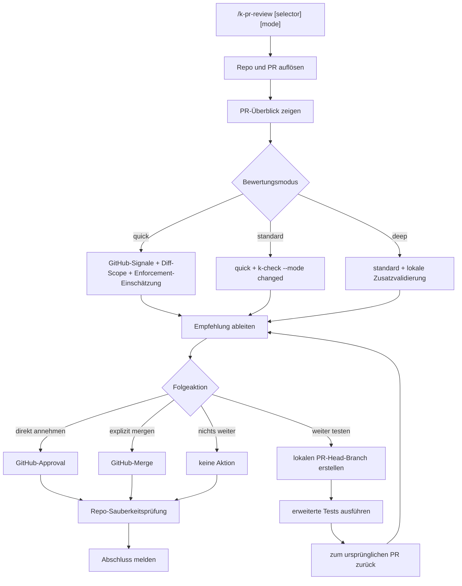

# /k-pr-review

Kurzer Guide für den PR-Check-Flow.

`/k-pr-review` dient dazu, einen Pull Request strukturiert zu bewerten, ihn vorab mit den passenden Checks zu testen und danach je nach Lage entweder zu approven, zu mergen oder beim Anlegen eines lokalen Branches für weitergehende Tests zu helfen.

## Zweck

`/k-pr-review` soll einen GitHub-PR für das in `K-PLAYBOOK.yaml` konfigurierte Repo laden, knapp bewerten und danach eine sinnvolle Folgeaktion anbieten: Approval, expliziter Merge oder ein lokaler Validierungs-Branch für weitergehende Tests.

Perspektivisch sollte der Flow außerdem eine Schnittstelle zu Jira oder Confluence bekommen, damit Bewertungen, Entscheidungen, Testergebnisse und Merge-Hinweise strukturiert außerhalb des Chats abgelegt werden können.

## Aufrufe

- `/k-pr-review`
- `/k-pr-review 454`
- `/k-pr-review #454`
- `/k-pr-review https://github.com/<owner>/<repo>/pull/454`
- `/k-pr-review quick`
- `/k-pr-review 454 standard`
- `/k-pr-review #454 deep`

## Phasen

1. Repo und PR auflösen
2. PR-Überblick zeigen
3. Bewertung in `quick`, `standard` oder `deep`
4. Empfehlung ableiten
5. Folgeaktion ausführen

## Schaubild

## Bewertungsmodi

- `quick`: GitHub-Signale, Diff-Scope, Enforcement-Einschätzung
- `standard`: `quick` plus `k-check --mode changed`
- `deep`: `standard` plus kleinste sinnvolle lokale Zusatzvalidierung

## Folgeaktionen

- `direkt annehmen`: Approval auf GitHub.
- `direkt mergen`: nur auf ausdrückliche Anfrage.
- `branch erstellen und weiter testen`: lokaler Validierungs-Branch vom PR-Head, erweiterter Testlauf, danach zurück zum ursprünglichen PR.
- `nichts weiter`

## Wichtige Regeln

- Kein automatischer Merge ohne ausdrückliche User-Anfrage
- PR-Kommentar- und Approval-Texte immer per `--body-file`, nie als fragiler Inline-Mehrzeiler
- Lokale Prüf-Branches sind nicht merge-relevant
- Merge-relevant bleibt immer der ursprüngliche PR
- Am Ende immer `git status --short --branch` prüfen

## Bereits praktisch getestet

Der Flow wurde bereits praktisch durchgespielt:

1. Offene PRs listen und PR auswählen
2. `standard`-Bewertung für echte PRs (`#441`, `#442`, `#454`)
3. Approval-Fall mit sauberem Self-Approval-Fehler
4. Branch-Flow für `#454`
5. Lokalen Validierungs-Branch anlegen
6. Erweiterte Tests auf dem Prüf-Branch ausführen
7. PR `#454` mergen
8. Lokale Branches aufräumen und Repo-Zustand prüfen

## Offene Grenze

Wenn GitHub wegen Branch-Protection, fehlenden Rechten oder Self-Approval blockiert, soll der Command das klar melden und keinen stillen Workaround versuchen.

Eine sinnvolle nächste Erweiterung ist die Ablage der PR-Ergebnisse in Jira oder Confluence, z. B. als verlinkte Review-Notiz, Entscheidungsprotokoll oder Testzusammenfassung.
