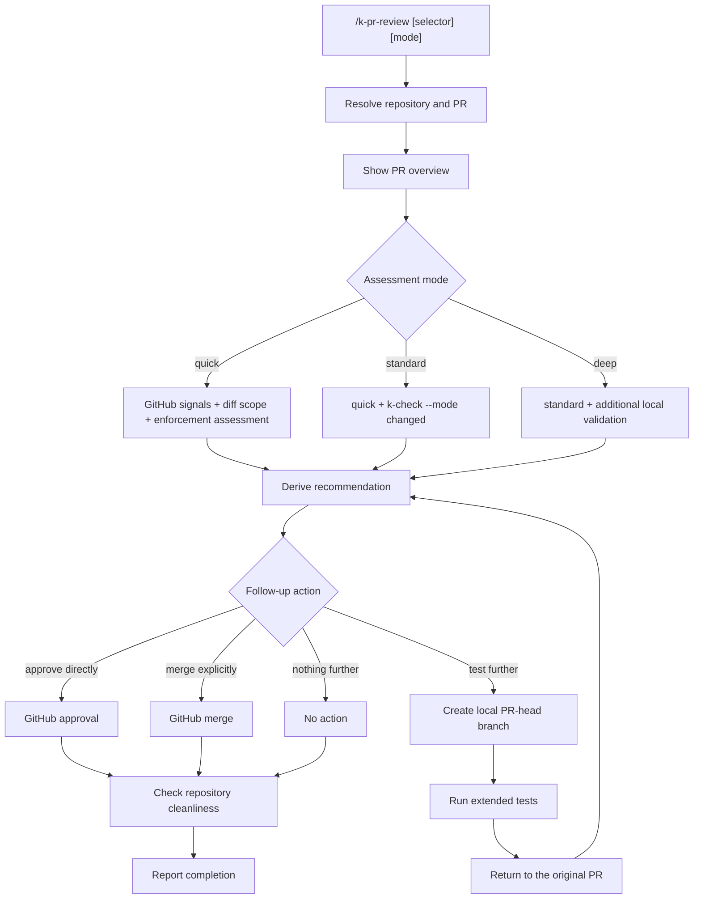

# /k-pr-review

Brief guide to the PR review flow.

`/k-pr-review` is used to assess a pull request in a structured way, test it in advance with the appropriate checks, and then, depending on the situation, approve it, merge it, or help create a local branch for more extensive testing.

## Purpose

`/k-pr-review` should load a GitHub PR for the repository configured in `K-PLAYBOOK.yaml`, assess it concisely, and then offer a sensible follow-up action: approval, an explicit merge, or a local validation branch for further testing.

In the future, the flow should also provide an interface to Jira or Confluence so that assessments, decisions, test results, and merge notes can be stored in a structured form outside the chat.

## Invocations

- `/k-pr-review`
- `/k-pr-review 454`
- `/k-pr-review #454`
- `/k-pr-review https://github.com/<owner>/<repo>/pull/454`
- `/k-pr-review quick`
- `/k-pr-review 454 standard`
- `/k-pr-review #454 deep`

## Phases

1. Resolve the repository and PR
2. Show the PR overview
3. Assess in `quick`, `standard`, or `deep` mode
4. Derive a recommendation
5. Perform the follow-up action

## Diagram

## Assessment Modes

- `quick`: GitHub signals, diff scope, enforcement assessment
- `standard`: `quick` plus `k-check --mode changed`
- `deep`: `standard` plus the smallest sensible additional local validation

## Follow-Up Actions

- `approve directly`: approve on GitHub.
- `merge directly`: only on an explicit request.
- `create a branch and test further`: create a local validation branch from the PR head, run extended tests, then return to the original PR.
- `nothing further`

## Important Rules

- Do not merge automatically without an explicit user request
- Always use `--body-file` for PR comments and approval text, never fragile inline multi-line text
- Local validation branches are not merge-relevant
- The original PR always remains merge-relevant
- Always check `git status --short --branch` at the end

## Already Tested in Practice

The flow has already been exercised in practice:

1. List open PRs and select a PR
2. Perform `standard` assessments for real PRs (`#441`, `#442`, `#454`)
3. Test the approval case with a clear self-approval error
4. Exercise the branch flow for `#454`
5. Create a local validation branch
6. Run extended tests on the validation branch
7. Merge PR `#454`
8. Clean up local branches and check repository state

## Open Boundary

If GitHub blocks an action because of branch protection, missing permissions, or self-approval, the command should report this clearly and must not attempt a silent workaround.

A sensible next extension is to store PR results in Jira or Confluence, for example as a linked review note, decision record, or test summary.
